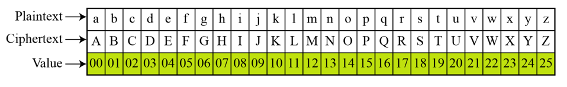
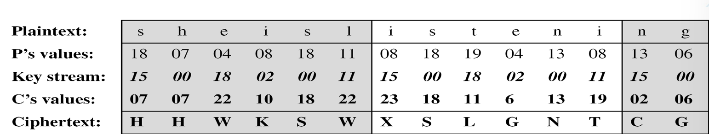
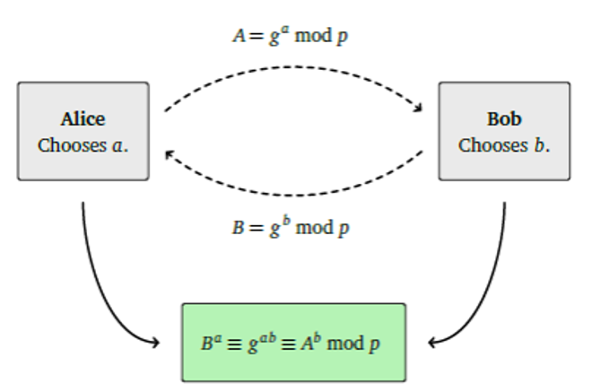
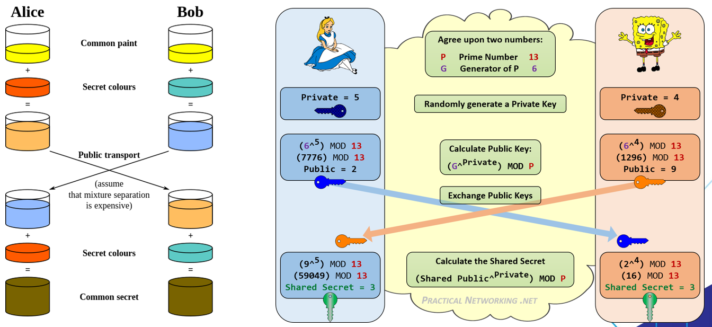
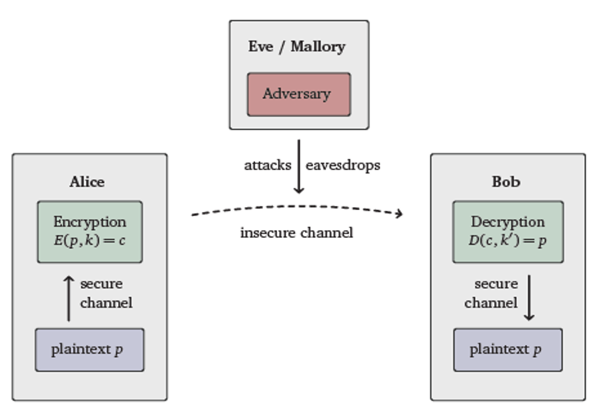

# Introduction of Cryptography

Why this exist?
Data Security :
- Network
- Chat (Text)

**Cryptolology**
from Ancient Greek: κρυπτός: kryptós "hidden, secret"; and γράφειν graphein, "to write", or -λογία -logia, "study", respectively
is the practice and study of techniques for data encryption - decryption

**Cryptography**
is a field of computer science and mathematics that focusses on techniques for secure communication between two parties while a third-party is present. This is based on methods like encryption, decryption, signing, generating of pseudo random numbers, etc.
Methods:
- Encryption
  - Modify plain text to cypher text
- Decryption
  - Modify cyper to plain text
> Encryption must have a decryption otherwise it means the encryption is failed
- Key
  - Public key / Private Key (Secret Key)
  - 

**Cryptoanalysis**
Is the practice and method to break the cryptography system illegaly.
Methods:
- Brute Force
- ETC

## History

### Caesar Shift Cipher
First in caesar (War between rival kingdom)
Using substitution called **Caesar Shift Cipher**. 

The simplest monoalphabetic cipher is the additive cipher. This cipher is sometimes called a shift cipher and sometimes a Caesar cipher, but the term additive cipher better reveals its mathematical nature. 

must have a key to shift the amount of alphabeth
Enc -> $(x+k) mod 26$
Dec -> $(x-k) mod 26$

### Vigenère’s cipher
A generalization of Caesar’s cipher is Vigenère’s cipher: It was invented several times, nowadays the reference goes back to the French cryptographer Blaise de Vigenère. 
The main difference is that instead of using only one $k \in Z$, we now use $k \in Z^n$ for some $n \in N$. 
For example, let the secret be represented by the word KEY. We again map the letters from the alphabet to corresponding numbers modulo 26: 
k = (10, 4, 24)

### Transposition (Rail)

### Defie Hellman Key Exchange

In 1976 Whitfield Diffie and Martin Hellman (and also Ralph Merkle) proposed an idea for securely exchanging keys over an insecure communication channel, nowadays known as Diffie-Hellman Key Exchange.

## Basic Idea of Cryptography

### Principles
Confidentiality 
 Defines a set of rules that limits access or adds restriction on certain information.
Data Integrity 
   Takes care of the consistency and accuracy of data during its entire life-cycle.
Authentication 
Confirms the truth of an attribute of a datum that is claimed to be true by some entity.
Non-Repudiation 
Ensures the inability of an author of a statement resp. a piece of information to deny it.

### Data Type
Data on transmitting
Signal transmitted  from phone’s conversation.
ATM PIN Number transmitted from ATM to the Bank’s Server
Credit Card PIN Number for e-commerce transactions by internet banking.
Message with chat media such as: Whatsapp, LINE, or BBM
Data on end system
Text
Multimedia data (picture, video, audio)
Database

### Basic Terms
plaintext - the original message 
ciphertext - the coded message 
cipher - algorithm for transforming plaintext to ciphertext 
key - info used in cipher known only to sender/receiver 
encipher (encrypt) - converting plaintext to ciphertext 
decipher (decrypt) - recovering ciphertext from plaintext

### Criteria
Total Number of key being used (eg.)
1 key
2 key
No key
Type of cipher (eg.)
Substitution
Transportition
Product
Process of plaintext (eg.)
Block Cipher
Stream Cipher

### Types of Cryptography

## Digital Cryptography
### Symmetric Cryptography
Method :
DES ( Data Encryption Standard)
AES (Advanced Encryption Standard)
Rijndael
Blowfish
IDEA (International Data Encryption Algorithm)
GOST
Serpent
RC2, RC4, RC5

### Assymetric Cryptography

#### Symmetric and Assymetric Difference

### Hash Function

