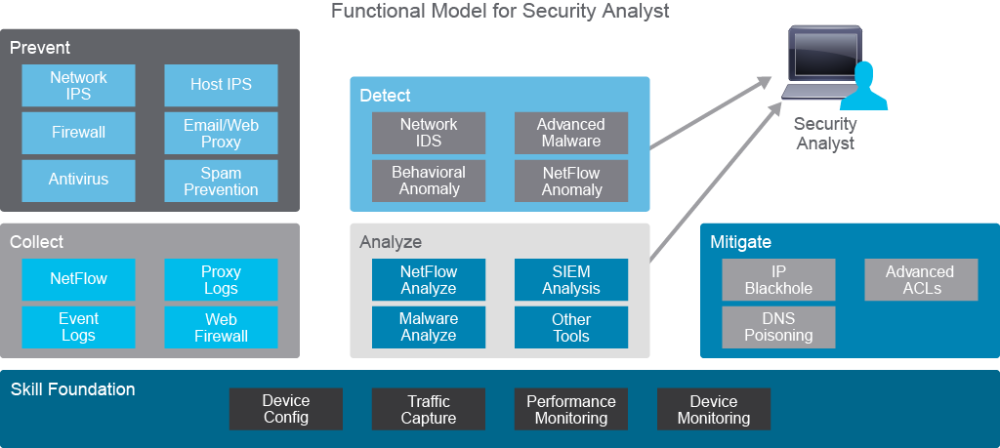

# SOC Interaction Between Role

## Incident Overview
A zero-day ransomware attack has been detected in Acme Inc.'s HR department. The SOC team responds to contain, eradicate, and remediate the threat.

## **Incident Timeline & Roles**

### **1. Initial Detection (Tier 1 - Rajiv, Triage Specialist)**
- HR Director reports a **ransomware pop-up** preventing file access.
- **SIEM alert** from Cisco IPS indicates **HR workstation is beaconing** (communicating with an attacker-controlled host).
- Rajiv escalates the incident to **Tier 2 analyst, John**.

### **2. Deep-Dive Investigation (Tier 2 - John, Incident Responder)**
- Confirms this is a **zero-day attack** with no known signatures or remediations.
- Uses **Cisco Malware Analytics Sandboxing** to analyze TTPs (Tactics, Techniques, and Procedures).
- Identifies modifications to **Windows OS** and attempts to connect to a **Command & Control (C2) server**.
- Notifies **NOC Director**, who approves **quarantine of the infected workstation**.
- Creates a **signature** to detect the malware in future.

### **3. Threat Containment & Eradication (Tier 3 - Rachel, Threat Hunter)**
- Verifies workstation isolation.
- Assesses risks, including possible **data loss** (e.g., PII, financial information).
- Conducts **threat hunting**:
  - Uses **MITRE ATT&CK framework**.
  - Examines **SIEM telemetry logs**.
  - Gathers **threat intelligence** (Cisco Talos, external research).
- Ensures the attack is fully contained.

### **4. Remediation & Recovery (Tier 1 & 2 - Rajiv & John)**
- Works with **IT** to deploy the **new malware signature** into Cisco Endpoint Protection software.
- Patches the **exploited HR workstation**.

### **5. Stakeholder Communication (SOC Manager - Rohan)**
- Keeps all stakeholders updated, including:
  - **CIO** (overall status, impact assessment).
  - **Legal department** (compliance & evidence gathering).
  - **HR department** (impacted employees, policy updates).
  - **Public Affairs** (if the incident might go public).
  - **Law enforcement** (if legal action is pursued).

### **6. Post-Incident Actions & Lessons Learned**
- Legal team works with **Rajiv & John** to gather **forensic evidence**.
- Ensures **evidence is court-admissible** for potential international legal action.
- Conducts a **Lessons Learned Debriefing** with:
  - **SOC, NOC, HR, Legal, Management** (internal review).
  - **External stakeholders** (if necessary).
- Reviews security measures & incident handling processes for **continuous improvement**.

# Addition
## **SOC Team Interactions**

### **Internal Stakeholders:**
- **NOC (Network Operations Center)** - Coordinates network isolation & security enhancements.
- **HR Department** - Reports the initial issue & follows remediation steps.
- **Legal Team** - Ensures compliance, prepares evidence for potential legal action.

### **External Stakeholders:**
- **Legal Entities** - Provides legal guidance on evidence handling & compliance.
- **Media Contacts** - Engaged if public disclosure is necessary.
- **International Courts** - If pursuing legal action against cybercriminals.

---
## **Conclusion**
The incident response was successfully executed using a **structured approach**:
1. **Detection & Triage (Tier 1)**
2. **Deep-Dive Investigation (Tier 2)**
3. **Containment & Threat Hunting (Tier 3)**
4. **Remediation & Patch Deployment**
5. **Stakeholder Communication**
6. **Lessons Learned & Continuous Improvement**

By following a **Zero-Trust Security Model** and leveraging **advanced SOC tools**, Acme Inc. successfully mitigated the ransomware attack and strengthened its cybersecurity posture.

## SOC Manager Responsibilities
A Security Operations Center (SOC) requires a manager to oversee its various components. The SOC manager plays a crucial role in:
- Responding to incidents within and outside the SOC.
- Prioritizing tasks and organizing resources for detection, investigation, and mitigation.
- Determining daily activities and the necessary skills for analysts.
- Developing workflow models and implementing Standard Operating Procedures (SOPs) for incident management.

## SOC Analyst Tiers and Responsibilities

### **Tier 1: Security Analyst (Entry-Level)**
Tier 1 analysts must have foundational knowledge of networking, traffic capture, and device monitoring. Their responsibilities include:
- Continuously monitoring the alert queue.
- Triaging security alerts.
- Monitoring the health of security sensors and endpoints.
- Collecting data and context necessary to escalate to Tier 2.

### **Tier 2: Incident Responder**
Tier 2 analysts perform a deeper analysis of security incidents. Their responsibilities include:
- Conducting deep-dive incident analysis by correlating data from various sources.
- Determining if critical systems or data sets have been impacted.
- Providing guidance on remediation.
- Supporting new analytic methods for threat detection.

### **Tier 3: Advanced Security Analyst & Threat Hunter**
Tier 3 analysts apply in-depth technical knowledge to proactively identify and mitigate threats. Their responsibilities include:
- Utilizing expertise in networks, endpoints, threat intelligence, forensics, and malware reverse engineering.
- Acting as proactive threat hunters who do not wait for escalated incidents.
- Developing, tuning, and implementing threat detection analytics.

## Internal and External Communication

### **Internal Stakeholder Communication**
Effective SOC operations require strong relationships with internal stakeholders, including:
- IT, networking, and software departments.
- Chief Information Security Officer (CISO) or Chief Information Officer (CIO).
- Legal department.
- Human Resources (HR) and Public Affairs.
- Company-wide workforce.

### **External Stakeholder Communication**
SOC teams may need to engage with external entities, such as:
- Legal entities.
- Media sources.
- International courts of law.
- US-CERT / CISA (Cybersecurity and Infrastructure Security Agency).

## Conclusion
A well-structured SOC ensures effective threat detection, investigation, and response. Clear communication, well-defined roles, and efficient processes contribute to a secure and resilient organization.
