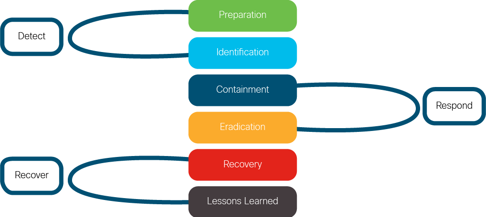

# Security Operations Center (SOC) Processes and Services  

## SOC Interaction with Other Departments  

SOC operations require collaboration with multiple departments to effectively manage security incidents.  

### **1. Security Operations Center (SOC)**  
- Prevents and responds to **IT security breaches**.  
- Works closely with the **Network Operations Center (NOC)**, **Legal**, and **Human Resources (HR)** teams.  

### **2. Network Operations Center (NOC) – IT Operations Team**  
- Executes actions requested by the SOC team.  
- Responsibilities:  
  - **Isolating compromised devices** to prevent further damage.  
  - **Making changes to IT infrastructure** as needed.  

### **3. Legal Department**  
- Must be **notified during a data breach** to ensure compliance with regulations.  
- Investigates **potential Service Level Agreement (SLA) violations** caused by security incidents.  

### **4. Human Resources (HR)**  
- Conducts **cybersecurity awareness training** for employees.  
- Manages **customer relations** and communication for those affected by security breaches.  

---

## Common SOC Services  

SOC engineers focus on:  
- **Detecting security incidents** in real time.  
- **Notifying the organization** about threats.  
- **Conducting forensic investigations** across departments.  

### **Phases of SOC Services**  

SOC offers services that begin before incidents occur and continue through incident resolution.  

### **1. Before an Incident – Preparation Phase**  
**Objective:** Strengthen cybersecurity defenses before an attack occurs.  

#### **Key Activities:**  
- **Data Processing & Refinement** – Organizing and analyzing security logs to filter out noise.  
- **Incident Response (IR) Findings & Intelligence** – Collecting insights from previous incidents to improve detection methods.  
- **Proactive Threat Hunting** – Identifying vulnerabilities before attackers exploit them.  
- **Security Awareness Training** – Educating employees to recognize and prevent cyber threats.  

---

### **2. During an Incident – Response Phase**  
**Objective:** Contain and neutralize threats as quickly as possible.  

#### **Key Activities:**  
- **Host Response Team Deployment** – Identifies and mitigates compromised systems.  
- **Malware Analysis** – Investigates malicious software to determine its impact and origin.  
- **Incident Containment** – Isolates affected systems to prevent lateral movement of attackers.  
- **Threat Intelligence Utilization** – Uses external threat data to understand attack patterns.  

---

### **3. After an Incident – Recovery Phase**  
**Objective:** Restore normal operations and prevent future incidents.  

#### **Key Activities:**  
- **Collaboration with Legal, HR, and Compliance Teams** – Ensures all reporting obligations are met.  
- **Evidence Collection & Digital Forensics** – Preserves artifacts for legal and investigative purposes.  
- **Lessons Learned & Post-Incident Review** – Documents findings to improve future security strategies.  
- **Investigative Techniques for Evidence Preservation** – Uses specialized methods to securely gather digital evidence.  

---

## Incident Response Framework (SANS Six-Step Plan)  

The **SANS Institute** provides a six-step **Incident Response Plan** widely used in cybersecurity.  

1. **Preparation:**  
   - Define security policies.  
   - Conduct risk assessments to identify critical assets.  
   - Establish a **Computer Security Incident Response Team (CSIRT)**.  

2. **Identification:**  
   - Detect and verify potential security incidents.  
   - Collect evidence to assess severity.  

3. **Containment:**  
   - Prevent further spread of the attack.  
   - Isolate affected systems.  

4. **Eradication:**  
   - Remove malware, unauthorized access, and vulnerabilities.  
   - Ensure no hidden threats remain.  

5. **Recovery:**  
   - Restore systems to normal operations.  
   - Validate security measures before reintroducing systems online.  

6. **Lessons Learned:**  
   - Conduct a post-incident review.  
   - Improve policies and procedures based on findings.  

