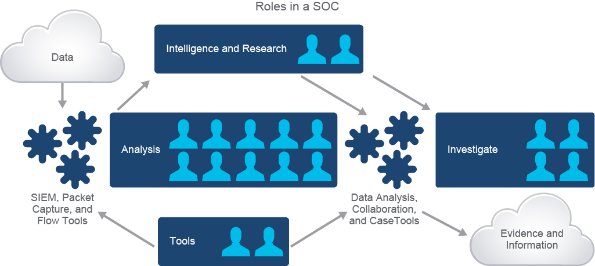
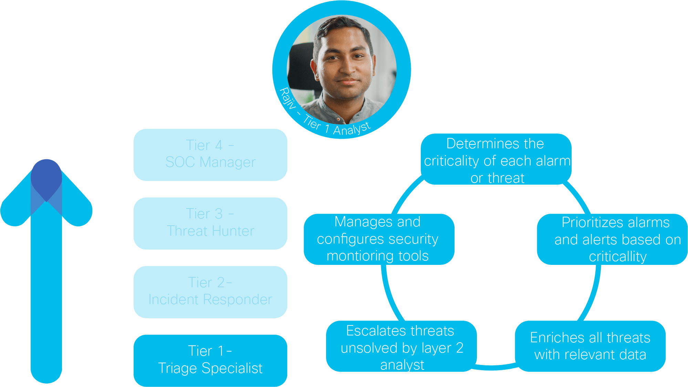
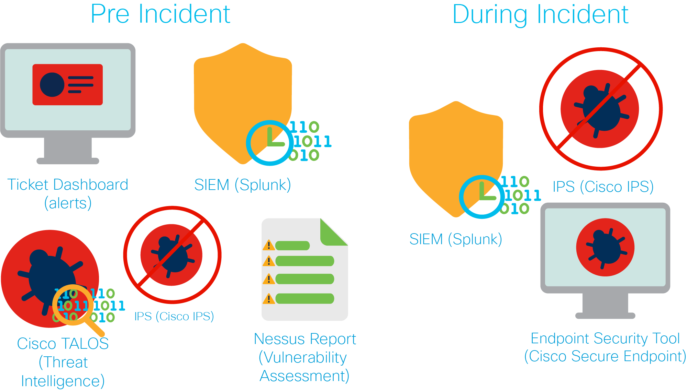

# Security Operations Center (SOC) Job Roles

## Overview
The following figure presents a high-level view of the potential job roles necessary for a SOC. 

An entry-level analyst typically performs initial triage for alerts generated from a:
- Security Information and Event Management tool (**SIEM**)
- IT Service Management (**ITSM**) ticketing system

After determining that an alert requires further investigation based on the SOC’s policies and workflow procedures, the analyst escalates the alert to the **investigation team**. The team:
- Collects data from available tools
- Performs event correlation to identify patterns or relationships
- Escalates to a senior member if further analysis is necessary

## SOC Job Role Variability
SOC job roles are not specifically defined across all organizations. Responsibilities may overlap between different roles, and standards have been ineffective at resolving this issue.

For example, the **NIST NICE workforce framework (NIST 800-181 Rev.1)** identifies knowledge, skills, and abilities (KSAs) under the following categories:
- **Investigate**
- **Collect and Operate**
- **Analyze**

However, organizations may have different interpretations, leading to overlaps in responsibilities.

---

# SOC Tasks and Responsibilities
A **SOC team member** helps identify the primary effects of cyberattacks. The goal of a SOC analyst is to determine:
- **When** an attack was successful
- **How** an attack happened
- **Why** an attack succeeded

A SOC analyst reviews **indicators of attack (IoA)** and, if successful, examines **indicators of compromise (IoC)** to help prevent similar attacks in the future. All SOC analysts require foundational skills, including:
- Device configuration
- Traffic capture
- Performance monitoring
- Device monitoring

### SOC Tier 1 Analyst: Triage Specialist
The **SOC Tier 1 analyst** is an entry-level position focusing on triage.

#### Responsibilities:

#### Note:
The **SOC Tier 1 analyst** has **sysadmin and scripting skills** with cybersecurity certifications such as:
- Cisco CyberOPS Associate
- Cisco CCNA
- CISSP
- CompTIA

---

### SOC Tier 2 Analyst: Incident Handler
The **SOC Tier 2 analyst** is the **incident responder**.

#### Responsibilities:
- Perform in-depth assessment of escalated incidents
- Provide attack context with additional telemetry data
- Identify actionable threat intelligence
- Determine the scope, nature, and affected systems of an attack
- Execute containment, remediation, and recovery strategies
- Escalate to Tier 3 when necessary

#### Note:
The **SOC Tier 2 analyst** has **broader and deeper skills** than the Tier 1 analyst, analyzing collected data for further investigation.

---

### SOC Tier 3 Analyst: Incident Responder & Threat Hunter
The **SOC Tier 3 analyst** is the **threat hunter** and a **subject matter expert**.

#### Responsibilities:
- Proactively identify threats, security gaps, and unknown vulnerabilities
- Research new attack techniques and model threats relevant to the organization
- Optimize security monitoring tools and assets
- Assist SOC analysts during major incidents

#### Note:
The **SOC Tier 3 analyst** is a **senior-level position** requiring:
- Broad expertise in **network security**
- Strong skills in **data analytics**
- Deep knowledge of **latest attack techniques**

---

### SOC Manager
The **SOC manager** oversees the SOC team and reports to the **Chief Information Security Officer (CISO)**.

#### Responsibilities:
- Manage team hiring, training, and evaluation
- Assess incident reports
- Develop and implement crisis communication procedures
- Oversee financial aspects of security operations
- Support security audits

---

# SOC Tools
The SOC team relies on various tools for different activities:

### 1. **IT Service Management (ITSM) System**
- Collects and manages security incident data
- Provides structured workflow automation
- Example: **ServiceNow**

### 2. **Security Information and Event Management (SIEM) System**
- Real-time monitoring, analysis, and event logging
- Includes **User and Entity Behavior Analytics (UEBA)** with AI/ML
- Example: **Splunk**

### 3. **Intrusion Detection System (IDS) / Intrusion Prevention System (IPS)**
- IDS: Alerts on potential incidents
- IPS: Takes automatic remediation actions
- **Types:**
  - **NIDS (Network IDS)**: Monitors network traffic
  - **HIDS (Host IDS)**: Monitors a single host
- Examples: **Cisco Firepower 4100 Series (NIDS/IPS), Cisco Secure Endpoint (HIDS/IPS)**

### 4. **Vulnerability Scanner**
- Assesses systems for misconfigurations, flaws, and missing patches
- Example: **Nessus**

### 5. **Threat Intelligence Service**
- Collects, processes, and disseminates threat intelligence
- Example: **Cisco Talos**

---

# Incident Response: Before, During, and After
### **Before an Incident**
- SOC analysts primarily **monitor** systems
- The **SOC Tier 1 triage specialist** focuses on ITSM ticketing alerts
- The **threat hunter** monitors threat intelligence feeds (e.g., Cisco Talos)

### **During an Incident**
- SOC analysts coordinate with stakeholders such as:
  - **Network Operations Center (NOC)**
  - **System and data owners**
  - **Legal & HR departments**

### **After an Incident**
- SOC enters the **recovery phase**:
  - **Forensics analysis** (e.g., Encase, Velociraptor, Redline)
  - **Legal compliance** for court procedures
  - **SOC 2 audit report** for compliance validation
  - **Lessons learned reports** to improve future responses

---

## Conclusion
The SOC plays a vital role in cybersecurity, requiring skilled analysts at different tiers. The use of various tools and collaboration with stakeholders ensures efficient threat detection, investigation, and response.
