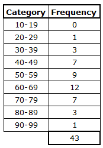
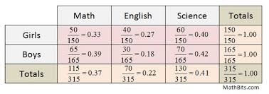
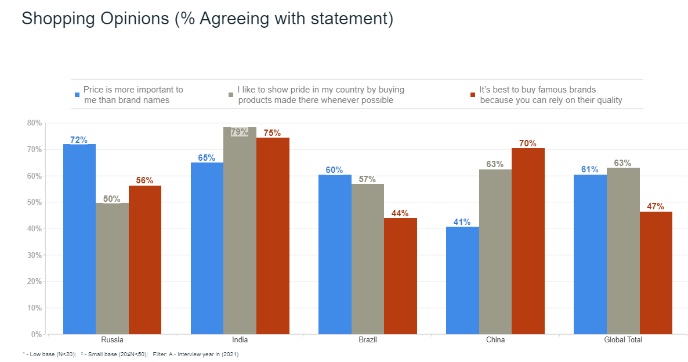

# Exploratory Data Analysis

## Summarizing Variables
- **Categorical Variables**
  - Freqeuncy Tables

  - Relative Frequency Tables

  - Barchart

  - Other plots
- **Continuous Vairables**
  - Bin the observations then, treat as ordered categorical.
  - Plots specific to continuous variables

### Goals of Summarizing Variables
Fill in

## Univariate
### Measures of Location
### Measures of Variability
### Measures of Heterogenity
### Measures of Concentration
### Measures of Asymmetry
### Measures of Kurtosis

### Numerical Data