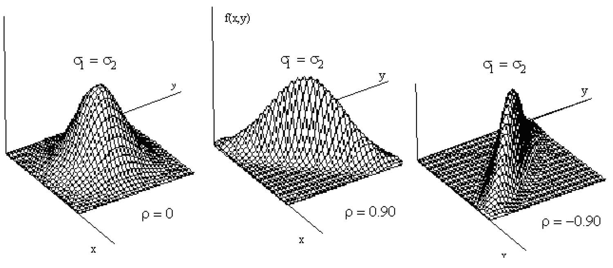

# **Bivariate Normal Distribution**

## **Bivariate Normal Formula**
The **bivariate normal distribution** describes the joint distribution of two continuous random variables, \( X_1 \) and \( X_2 \), which may be correlated. The probability density function (PDF) for the bivariate normal distribution is given as:

$$
f(x_1, x_2) = \frac{1}{2\pi |\Sigma|^{1/2}} \exp\left(-\frac{1}{2} Z\right)
$$

### **Components of the Formula**
1. **Mean Vector (\(\mu\))**:
   $$
   \mu = \begin{bmatrix} \mu_1 \\ \mu_2 \end{bmatrix}
   $$
   - \( \mu_1 \): Mean of \( X_1 \).
   - \( \mu_2 \): Mean of \( X_2 \).

2. **Covariance Matrix (\(\Sigma\))**:
   $$
   \Sigma = \begin{bmatrix}
   \sigma_1^2 & \rho \sigma_1 \sigma_2 \\
   \rho \sigma_1 \sigma_2 & \sigma_2^2
   \end{bmatrix}
   $$
   - \( \sigma_1^2 \): Variance of \( X_1 \).
   - \( \sigma_2^2 \): Variance of \( X_2 \).
   - \( \rho \): Correlation coefficient between \( X_1 \) and \( X_2 \).

## **Explanation of \( |\Sigma| \)**
The term \( |\Sigma| \) refers to the determinant of the covariance matrix \(\Sigma\). It represents the "volume scaling factor" introduced by the joint covariance structure of the two variables. For the covariance matrix:
$$
\Sigma = \begin{bmatrix}
\sigma_1^2 & \rho \sigma_1 \sigma_2 \\
\rho \sigma_1 \sigma_2 & \sigma_2^2
\end{bmatrix},
$$
the determinant is calculated as:

\[
|\Sigma| = \sigma_{11}\sigma_{22} - \sigma_{12}^2 = \sigma_1^2 \sigma_2^2 (1 - \rho^2)
\]

### **Implications of \( |\Sigma| \)**:
- If \( \rho = 0 \) (no correlation), \( |\Sigma| = \sigma_1^2 \sigma_2^2 \), reflecting independent variances.
- As \( \rho \) approaches \( \pm 1 \) (perfect correlation), \( |\Sigma| \to 0 \), indicating collinearity and a degenerating distribution

## **Expanding \( Z \)**
The term \( Z \) in the exponent is a quadratic form describing the Mahalanobis distance for the bivariate case:
$$
Z = \begin{bmatrix} x_1 - \mu_1 \\ x_2 - \mu_2 \end{bmatrix}^\top \Sigma^{-1} \begin{bmatrix} x_1 - \mu_1 \\ x_2 - \mu_2 \end{bmatrix}.
$$
With,
\( \Sigma^{-1} \):
$$
\Sigma^{-1} = \frac{1}{|\Sigma|} \begin{bmatrix}
\sigma_2^2 & -\rho \sigma_1 \sigma_2 \\
-\rho \sigma_1 \sigma_2 & \sigma_1^2
\end{bmatrix}.
$$

### **Interpretation of \( Z \)**:
- \( Z \) measures the standardized squared distance of the point \( (x_1, x_2) \) from the mean vector \( (\mu_1, \mu_2) \), considering the correlation between the variables.

## More Calculation

\[
\begin{aligned}
    (\vec{x} - \vec{\mu})' \Sigma^{-1} (\vec{x} - \vec{\mu}) 
    &= [x_1 - \mu_1, x_2 - \mu_2]
    \begin{bmatrix}
        \sigma_{11} & \sigma_{12} \\
        \sigma_{12} & \sigma_{22}
    \end{bmatrix}^{-1}
    \begin{bmatrix}
        x_1 - \mu_1 \\
        x_2 - \mu_2
    \end{bmatrix} \\
    &= \frac{1}{|\Sigma|}
    [x_1 - \mu_1, x_2 - \mu_2]
    \begin{bmatrix}
        \sigma_{22} & -\sigma_{12} \\
        -\sigma_{12} & \sigma_{11}
    \end{bmatrix}
    \begin{bmatrix}
        x_1 - \mu_1 \\
        x_2 - \mu_2
    \end{bmatrix} \\
    &= \frac{1}{|\Sigma|} \Big\{ \sigma_{22} (x_1 - \mu_1)^2 - 2\sigma_{12} (x_1 - \mu_1)(x_2 - \mu_2) + \sigma_{11} (x_2 - \mu_2)^2 \Big\} \\
    &= \frac{\Big\{ \sigma_2^2 (x_1 - \mu_1)^2 - 2\rho \sigma_1 \sigma_2 (x_1 - \mu_1)(x_2 - \mu_2) + \sigma_1^2 (x_2 - \mu_2)^2 \Big\}}{\sigma_1^2 \sigma_2^2 (1 - \rho^2)} \\
    &= \frac{\Big\{ \left( \frac{x_1 - \mu_1}{\sigma_1} \right)^2 - 2\rho \left( \frac{x_1 - \mu_1}{\sigma_1} \right) \left( \frac{x_2 - \mu_2}{\sigma_2} \right) + \left( \frac{x_2 - \mu_2}{\sigma_2} \right)^2 \Big\}}{1 - \rho^2}
\end{aligned}
\]

**Hence,**
$$
\begin{aligned}
f(x_1, x_2) &= \frac{1}{(2\pi) |\Sigma|^{1/2}} 
e^{-\frac{1}{2} (\vec{x} - \vec{\mu})' \Sigma^{-1} (\vec{x} - \vec{\mu})} \\
&= \frac{1}{(2\pi) \sigma_1 \sigma_2 \sqrt{1 - \rho^2}} 
e^{-\frac{1}{2} Q(x_1, x_2)}
\end{aligned}
$$

**Where**
$$
Q(x_1, x_2) = \frac{ (\frac{x_1 - \mu_1}{\sigma_1})^2 - 2\rho (\frac{x_1 - \mu_1}{\sigma_1})(\frac{x_2 - \mu_2}{\sigma_2})+(\frac{x_2 - \mu_2}{\sigma_2})^2}{1 - \rho^2} 
$$

## **Probability Density Function (PDF)**
The PDF of the bivariate normal distribution is given by:
$$
f(x_1, x_2) = \frac{1}{(2\pi) \sigma_1 \sigma_2 \sqrt{1 - \rho^2}} 
e^{-\frac{1}{2} Q(x_1, x_2)}
$$

Where:
1. **Quadratic Form (\(Q(x_1, x_2)\)):**
   $$
   Q(x_1, x_2) = \frac{\left( \frac{x_1 - \mu_1}{\sigma_1} \right)^2 - 2\rho \left( \frac{x_1 - \mu_1}{\sigma_1} \right) \left( \frac{x_2 - \mu_2}{\sigma_2} \right) + \left( \frac{x_2 - \mu_2}{\sigma_2} \right)^2}{1 - \rho^2}
   $$

2. \( \mu_1, \mu_2 \): Means of \( X_1 \) and \( X_2 \), respectively.

3. \( \sigma_1, \sigma_2 \): Standard deviations of \( X_1 \) and \( X_2 \), respectively.

4. \( \rho \): Correlation coefficient between \( X_1 \) and \( X_2 \)

### **Constant Density and Ellipses**
The probability density \( f(x_1, x_2) \) is **constant** when \( Q(x_1, x_2) \) is constant. This happens when the points \((x_1, x_2)\) lie on an **ellipse** centered at \( (\mu_1, \mu_2) \).

#### **Why is \( f(x_1, x_2) \) Constant When \( Q(x_1, x_2) \) is Constant?**
The density function \( f(x_1, x_2) \) depends on the term \( Q(x_1, x_2) \) in the exponent of the exponential function:
$$
f(x_1, x_2) \propto e^{-\frac{1}{2} Q(x_1, x_2)}.
$$

- The value of the exponential function \( e^{-\frac{1}{2} Q(x_1, x_2)} \) remains constant if its exponent \( -\frac{1}{2} Q(x_1, x_2) \) is constant.
- Therefore, \( f(x_1, x_2) \) is constant when \( Q(x_1, x_2) \) is constant.

#### **Ellipses in the Plane**
- The equation for \( Q(x_1, x_2) \) represents a **quadratic form**, which describes an **ellipse** in the \( x_1 \)-\( x_2 \) plane.
- The ellipse is centered at \( (\mu_1, \mu_2) \), with:
  - Major and minor axes determined by the variances (\( \sigma_1^2, \sigma_2^2 \)) and the correlation (\( \rho \)).
  - Shape and orientation influenced by the covariance structure.

Thus, when \( x_1 \) and \( x_2 \) lie on this ellipse, the quadratic form \( Q(x_1, x_2) \) is constant, ensuring that \( f(x_1, x_2) \) also remains constant.

The bivariate normal distribution's PDF is constant along elliptical contours. These ellipses reflect regions of equal probability density, defined by the relationship between \( x_1 \) and \( x_2 \), the mean vector \( (\mu_1, \mu_2) \), and the covariance structure. This feature makes the bivariate normal distribution particularly useful for modeling correlated continuous random variables.

## The Bivariate Normal Distribution

### Surface Plots

Bivariate surface plots are a way to visually represent a relationship between two independent variables and one dependent variable. 

Bivariate surface plots are three-dimensional plots where:
- **X-axis** and **Y-axis** represent two independent variables (e.g., \( x \) and \( y \)).
- **Z-axis** represents the dependent variable (\( f(x, y) \)), often computed as a function of \( x \) and \( y \).

These plots are particularly useful in visualizing multivariate functions, identifying trends, and understanding how changes in the two variables jointly affect the dependent variable.

#### **Characteristics of Bivariate Surface Plots**
Here are some key features and characteristics:

##### **a. Surface Curvature:**
- The shape of the surface reveals the nature of the relationship between \( x \), \( y \), and \( f(x, y) \).
- A **flat surface** implies minimal or no interaction between \( x \) and \( y \).
- A **curved surface** indicates significant variation in \( f(x, y) \) as \( x \) and \( y \) change.

##### **b. Impact of Correlation:**
When \( x \) and \( y \) are correlated (positively or negatively), the bivariate surface plot changes:
- **No Correlation (\( \rho = 0 \))**: The surface is typically symmetric, showing independent contributions of \( x \) and \( y \).
- **Positive Correlation (\( \rho > 0 \))**: The surface elongates along a diagonal direction (e.g., \( x \) and \( y \) increase together).
- **Negative Correlation (\( \rho < 0 \))**: The surface stretches along the opposite diagonal (e.g., \( x \) increases while \( y \) decreases).

##### **c. Peaks and Valleys:**
- Peaks and valleys are critical points where \( f(x, y) \) reaches local maxima or minima.
- These features help identify optima or thresholds in the relationship.

##### **d. Smoothness:**
- A smooth surface reflects continuous functions, while irregularities suggest abrupt changes or discontinuities.

#### **Characteristics Observed in Your Case**
Using your example of varying correlation (\( \rho = 0 \), \( 0.90 \), and \( -0.90 \)):
- **Left Plot (\( \rho = 0 \))**: The surface is symmetric and shows no diagonal stretching. This indicates \( x \) and \( y \) contribute independently to \( f(x, y) \).
- **Middle Plot (\( \rho = 0.90 \))**: The surface is elongated along the positive diagonal, showcasing how strongly \( x \) and \( y \) move together.
- **Right Plot (\( \rho = -0.90 \))**: The surface is elongated in the opposite diagonal, indicating an inverse relationship where increases in \( x \) correspond to decreases in \( y \).

#### **Applications of Bivariate Surface Plots**
- **Data Analysis**: Identifying trends or interactions in multivariate data.
- **Optimization Problems**: Visualizing maxima, minima, and saddle points.
- **Statistical Models**: Representing joint distributions, especially in fields like finance, physics, or machine learning.
- **Engineering Design**: Analyzing the effects of two variables on system performance.

### Contour Plots

Contour plots represent the level curves of a probability density function (PDF) of a bivariate normal distribution. Each contour represents points where the PDF takes a constant value, creating a clear visualization of the shape and spread of the distribution. 

In a bivariate normal distribution:
- \( \mu_1, \mu_2 \): Means of the two variables (\( X \) and \( Y \)).
- \( \sigma_1, \sigma_2 \): Standard deviations of the two variables.
- \( \rho \): Correlation coefficient, representing the strength and direction of the linear relationship between \( X \) and \( Y \).

The correlation coefficient (\( \rho \)) significantly affects the shape and orientation of these contours.

#### **Characteristics of the Plots**
Each plot corresponds to different values of the correlation coefficient \( \rho \):

1. **Left Plot (\( \rho = 0 \))**:
   - The contours are **concentric circles**, indicating no correlation between the variables \( X \) and \( Y \).
   - Since \( \rho = 0 \), \( X \) and \( Y \) are independent, and changes in one variable have no linear relationship with changes in the other.
   - Equal variances (\( \sigma_1 = \sigma_2 \)) result in symmetric circles around the mean.

2. **Middle Plot (\( \rho = 0.9 \))**:
   - The contours are **elliptical** and oriented along the line \( Y = X \).
   - A positive correlation (\( \rho > 0 \)) causes the variables to move together in the same direction. Higher values of \( X \) are associated with higher values of \( Y \).
   - The elongation of the ellipse shows the strength of the relationship—stronger correlations lead to narrower ellipses.

3. **Right Plot (\( \rho = -0.9 \))**:
   - The contours are also elliptical but oriented along \( Y = -X \).
   - A negative correlation (\( \rho < 0 \)) indicates that increases in \( X \) correspond to decreases in \( Y \).
   - The strong negative correlation (\( \rho = -0.9 \)) results in highly elongated contours along the inverse diagonal.

#### **Key Insights**
- The **shape** of the contours changes from circles to ellipses as the correlation (\( \rho \)) moves away from zero.
- The **orientation** of the ellipses (diagonal slope) reflects the direction of the correlation.
- The **degree of elongation** corresponds to the strength of the correlation. Stronger correlations (\( |\rho| \) close to 1) produce narrower ellipses, while weaker correlations result in less pronounced elongation.

#### **Applications**
Contour plots of bivariate normal distributions are widely used in:
- **Statistics**: Visualizing joint distributions of two continuous variables.
- **Machine Learning**: Understanding relationships between features in multivariate data.
- **Econometrics**: Analyzing dependencies in financial variables (e.g., stock returns).

### Scatter Plots

A scatter plot of a bivariate normal distribution shows the joint distribution of two variables (\( X \) and \( Y \)), where each variable is normally distributed. The shape, clustering, and orientation of the scatter points change with the correlation coefficient (\( \rho \)).

#### **Characteristics of the Scatter Plots**
##### **Left Plot (\( \rho = 0 \)):**
- The points are **randomly scattered** around the mean values (\( \mu_1, \mu_2 \)).
- This represents **no linear relationship** between \( X \) and \( Y \). 
- The spread is symmetric, forming a circular pattern (because the covariance between \( X \) and \( Y \) is zero).

##### **Middle Plot (\( \rho = 0.9 \)):**
- The points are tightly clustered along a **positively sloped diagonal line**.
- This indicates a **strong positive correlation**: as \( X \) increases, \( Y \) tends to increase proportionally.
- The stronger the correlation, the narrower and more linear the cluster of points.

##### **Right Plot (\( \rho = -0.9 \)):**
- The points form a narrow cluster along a **negatively sloped diagonal line**.
- This reflects a **strong negative correlation**: as \( X \) increases, \( Y \) decreases in a proportional manner.
- The strong inverse relationship causes the elongated and linear spread, similar to the middle plot but with an opposite slope.

#### **Key Insights**
- The **strength of correlation** (\( |\rho| \)) affects the tightness of the clustering. Strong correlations (close to \( \pm 1 \)) produce narrow, linear clusters, while weak correlations (\( \rho = 0 \)) result in broader and less defined spreads.
- The **direction of correlation** (positive or negative) determines whether the cluster aligns with a positively or negatively sloped line.

#### **Applications**
Scatter plots of bivariate normal distributions are commonly used to:
- Visualize relationships in multivariate data.
- Understand dependency between two variables in fields like finance, biology, or engineering.
- Identify trends and correlations for statistical modeling.

The formula in your image represents the **probability density function (PDF)** of a **bivariate normal distribution**. Let me break it down step by step for you:

### **Conditions and Parameters**
The following conditions ensure the PDF is valid:
- \(-\infty < x, y < \infty\)
- \(-1 < \rho < 1\)
- \(\sigma_X > 0, \sigma_Y > 0\)

### **Independent Variables of \(X\) and \(Y\)**

The image highlights the joint distribution of two **independent random variables**, \(X\) and \(Y\), by providing both a 3D surface plot and a 2D contour plot of their probability density function (PDF). 

The bivariate PDF for independent random variables \(X\) and \(Y\) is given by:
\[
f_{XY}(x, y) = f_X(x) \cdot f_Y(y),
\]
where \(f_X(x)\) and \(f_Y(y)\) are the marginal PDFs of \(X\) and \(Y\), respectively. 

In this case:
- Both \(X\) and \(Y\) are assumed to follow normal (Gaussian) distributions.
- The **independence** of \(X\) and \(Y\) implies that their joint distribution is the product of their individual distributions, and there is no linear correlation (\(\rho = 0\)) between them.

The bivariate normal distribution can be expressed as:
\[
f_{XY}(x, y) = \frac{1}{2 \pi \sigma_X \sigma_Y} \exp\left( 
-\frac{(x - \mu_X)^2}{2 \sigma_X^2} - \frac{(y - \mu_Y)^2}{2 \sigma_Y^2}
\right),
\]
where:
- \(\mu_X, \mu_Y\): Means (expected values) of \(X\) and \(Y\).
- \(\sigma_X, \sigma_Y\): Standard deviations of \(X\) and \(Y\).

The negative exponential structure in the formula determines the shape and spread of the density function.

#### **Characteristics of the Plots**

##### **a. Surface Plot**:
- The surface plot illustrates the joint PDF, \(f_{XY}(x, y)\), with \(x\), \(y\), and \(z\)-axes representing \(X\), \(Y\), and the density \(f_{XY}(x, y)\), respectively.
- The surface appears symmetric and bell-shaped, emphasizing the independence of \(X\) and \(Y\).
- The height of the surface (\(f_{XY}(x, y)\)) decreases as the values of \(X\) and \(Y\) deviate farther from their respective means (\(\mu_X, \mu_Y\)).

##### **b. 2D Contour Plot**:
- The contour plot provides a top-down view of the joint PDF, where each contour line represents a constant density value.
- For independent variables:
  - The contours form **concentric circles** (when \(X\) and \(Y\) have equal variances, \(\sigma_X = \sigma_Y\)), or
  - **Concentric ellipses** (if \(\sigma_X \neq \sigma_Y\)).
  - These shapes reflect the symmetry and lack of correlation between \(X\) and \(Y\).
- The center of the circles/ellipses is located at \((\mu_X, \mu_Y)\), which represents the mean of the bivariate distribution.

#### **Independence and Correlation**
When \(X\) and \(Y\) are independent:
- The covariance between \(X\) and \(Y\) is zero:
  \[
  \text{Cov}(X, Y) = \mathbb{E}[(X - \mu_X)(Y - \mu_Y)] = 0.
  \]
- This implies that the correlation coefficient (\(\rho\)) is also zero:
  \[
  \rho = \frac{\text{Cov}(X, Y)}{\sigma_X \sigma_Y} = 0.
  \]

Independence ensures that variations in one variable do not influence the other, leading to the symmetric patterns in the contour plots.

#### **Interpretation of the Plots**
- **Symmetry**: Both plots highlight that the joint distribution is symmetric about the means \((\mu_X, \mu_Y)\).
- **Spread**: The spread of the density function along each axis is determined by the variances (\(\sigma_X^2, \sigma_Y^2\)). Larger variances result in wider and flatter distributions.
- **Shape of Contours**: The circular (or elliptical) nature of the contours is a hallmark of independence and the lack of a preferred orientation in the data.

### **Dependent Variables of \(X\) and \(Y\)**

### *Bivariate Normal Distribution**
When two variables \( X \) and \( Y \) are normally distributed and correlated (\( \rho \neq 0 \)), their joint distribution is called a **bivariate normal distribution**. The joint probability density function (PDF) in this case is an elliptical Gaussian function.

#### **Understanding the Contour Plots (2D View)**
- The **contour plots** represent the level curves of the PDF, where the height of the distribution remains constant.
- For **dependent variables**, the key feature is the formation of **diagonal concentric ellipses**, where:
  - The **major/minor axes** of the ellipses are **not parallel to the axes** (X or Y). Instead, they’re oriented diagonally, reflecting the linear relationship between \( X \) and \( Y \) due to correlation.
  - The **center of the ellipses** is located at \((\mu_X, \mu_Y)\), the means of \( X \) and \( Y \), respectively.

#### **Understanding the 3D Surface Plot**
- The 3D plot shows the **shape of the joint PDF** as a three-dimensional bell curve:
  - **Peak at the center**: The highest density is at the mean point \((\mu_X, \mu_Y)\), where the values of \( X \) and \( Y \) are most likely to occur.
  - **Elliptical base**: The base of the surface is an ellipse, reflecting the correlation and the shape of the 2D contours.

#### **Characteristics of Dependency in Bivariate Distributions**
When \( X \) and \( Y \) are dependent:
- The **orientation of the ellipses** reflects the direction of the correlation:
  - **Positive correlation (\( \rho > 0 \))**: The ellipses tilt in the direction of \( X = Y \), showing that \( X \) and \( Y \) increase together.
  - **Negative correlation (\( \rho < 0 \))**: The ellipses tilt in the opposite direction (along \( X = -Y \)), indicating an inverse relationship.
- The **narrowness or broadness of the ellipses** depends on the strength of the correlation:
  - **Stronger correlation (\( |\rho| \to 1 \))**: Ellipses become narrower and more elongated.
  - **Weaker correlation (\( |\rho| \to 0 \))**: Ellipses become more circular, indicating independence.

#### **Scientific Insight**
The tilted ellipses and the 3D surface plot make the relationship between \( X \) and \( Y \) visually clear:
- The farther a point lies from the center \((\mu_X, \mu_Y)\), the less likely that combination of values occurs.
- The density decreases exponentially as you move away from the mean, capturing the joint distribution's characteristics.
