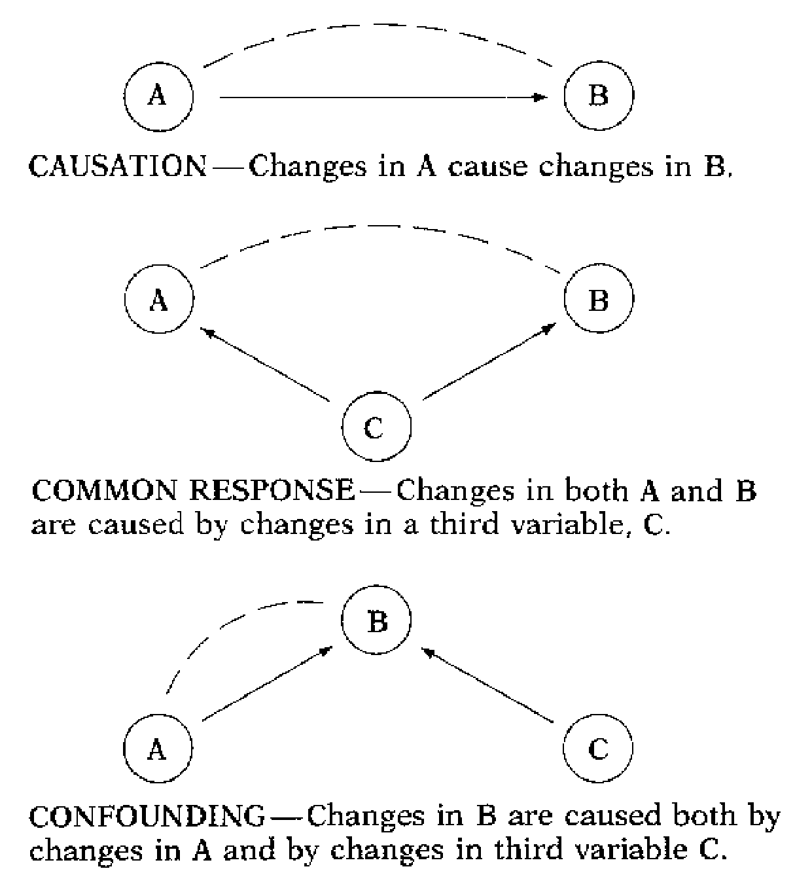

# Multivariate Normal Distribution

## Multivariate Analysis (MVA)

### Overview
Many statistical techniques focus on analyzing just **one** or **two** variables at a time. However, in many real-world scenarios, we need to analyze relationships among **multiple variables simultaneously**. This is where **Multivariate Analysis (MVA)** comes into play.

### What is Multivariate Analysis?
Multivariate Analysis (MVA) refers to a set of statistical techniques used to analyze data that involves **more than two variables** at the same time.

### Key Characteristics:
- Examines relationships among multiple variables.
- Helps identify patterns and structures in high-dimensional data.
- Commonly used in fields like finance, medicine, social sciences, and machine learning.

### Multiple Regression and MVA
- **Multiple regression** is not typically categorized under MVA.
- However, it can be considered a multivariate method because it involves multiple predictor variables to explain a single dependent variable.
- True **multivariate regression** extends this concept to multiple dependent variables.

### Importance of MVA
- Provides a **holistic view** of complex datasets.
- Enhances **predictive modeling** and decision-making.
- Essential in **big data** and machine learning applications.

Multivariate analysis techniques are crucial for understanding complex relationships that cannot be captured with univariate or bivariate methods alone.

## Simpson's Paradox

### Overview
- Many statistical techniques focus on just one or two variables.
- **Multivariate Analysis (MVA)** allows more than two variables to be analyzed simultaneously.
- **Multiple regression** is sometimes considered a form of multivariate analysis.

### Example: University Admission Rates
- 44% of male applicants are admitted, but only 33% of female applicants.
- This may suggest gender-based discrimination.
- However, further investigation reveals important details.

#### Admission Breakdown
|   | Male | Female |
|---|------|--------|
| Accept | 35 | 20 |
| Refuse Entry | 45 | 40 |
| **Total** | 80 | 60 |

- The university investigates the admission process by dividing applications into **Engineering** and **English** programs.

#### Detailed Admission Breakdown
##### Engineering Program
|   | Male | Female |
|---|------|--------|
| Accept | 30 | 10 |
| Refuse Entry | 30 | 10 |
| **Total** | 60 | 20 |

##### English Program
|   | Male | Female |
|---|------|--------|
| Accept | 5 | 10 |
| Refuse Entry | 15 | 30 |
| **Total** | 20 | 40 |

#### Interpretation
- There is **no direct relationship** between gender and acceptance rate in each program.
- More females apply for the **English** program, which has a lower acceptance rate.
- More males apply for **Engineering**, which has a higher acceptance rate.
- The observed discrepancy is due to **differences in application distribution** rather than gender bias.

### Another Example: Economists’ Starting Salaries
- A study found a **negative correlation** between the level of degree and starting salary.
  - **PhDs** earned less than **Master's** degree holders.
  - **Master's** holders earned less than **Bachelor’s** degree holders.
- Why?
  - Data was split into three employment sectors: **Teaching, Government, Private Industry**.
  - Within each sector, a **higher degree was associated with higher salaries**.
  - The **employer type** was confounded with degree level, leading to misleading overall conclusions.

- **Simpson’s Paradox** occurs when trends appearing in aggregated data **reverse** when the data is divided into subgroups.
- It highlights the **importance of considering confounding variables**.
- **Context matters**—simple summary statistics can be misleading.

The image illustrates three different types of relationships between variables: **causation, common response, and confounding**. Here's an explanation of each:

1. **Causation**  
   - **Diagram:** \( A \to B \)  
   - **Explanation:** Changes in variable \( A \) **directly cause** changes in variable \( B \).  
   - **Example:** More studying (\( A \)) leads to better exam scores (\( B \)).

2. **Common Response**  
   - **Diagram:** \( C \to A \) and \( C \to B \)  
   - **Explanation:** A third variable \( C \) influences **both** \( A \) and \( B \), creating a correlation between them even though \( A \) does not cause \( B \).  
   - **Example:** Ice cream sales (\( A \)) and drowning incidents (\( B \)) increase together, but they are both influenced by **temperature** (\( C \)).

3. **Confounding**  
   - **Diagram:** \( A \to B \) and \( C \to B \)  
   - **Explanation:** Variable \( B \) is affected by both \( A \) and a third variable \( C \), making it difficult to determine the true effect of \( A \) on \( B \).  
   - **Example:** A study suggests that drinking coffee (\( A \)) increases heart disease (\( B \)), but **smoking** (\( C \)) is a confounding factor because coffee drinkers may also smoke more, which contributes to heart disease.

## Multivariate Analysis Methods
### a. Analysis of Dependence
- Used when one or more variables are dependent on others.
- Objective: To explain or predict the dependent variable.
- Examples:
  - **Multiple Regression**: Predicts one variable using multiple predictors.
  - **PLS (Partial Least Squares)**: Used for predictive modeling.
  - **MDA (Multiple Discriminant Analysis)**: Classifies observations into predefined groups.

### b. Analysis of Interdependence
- No predefined dependent variable.
- Focuses on relationships among variables, objects, or cases.
- Examples:
  - **Cluster Analysis**: Groups similar observations.
  - **Factor Analysis**: Reduces the number of variables by identifying underlying factors.

1. **Random Vector \(\vec{x}\):**
   - \(\vec{x}\) is a vector of random variables:
     \[
     \vec{x} = 
     \begin{bmatrix}
     x_1 \\
     \vdots \\
     x_p
     \end{bmatrix}
     \]
   - Each \(x_i\) represents a random variable, and together they form a random vector in \(p\)-dimensional space.

2. **Mean Vector \(\vec{\mu}\):**
   - \(\vec{\mu}\) is a vector of constants representing the mean values of the random variables:
     \[
     \vec{\mu} = 
     \begin{bmatrix}
     \mu_1 \\
     \vdots \\
     \mu_p
     \end{bmatrix}
     \]
   - Each \(\mu_i\) is the expected value (mean) of the corresponding random variable \(x_i\).

3. **Covariance Matrix \(\Sigma\):**
   - \(\Sigma\) is a \(p \times p\) symmetric and positive definite matrix that contains the variances and covariances of the random variables:
     \[
     \Sigma = 
     \begin{bmatrix}
     \sigma_{11} & \cdots & \sigma_{1p} \\
     \vdots & \ddots & \vdots \\
     \sigma_{1p} & \cdots & \sigma_{pp}
     \end{bmatrix}
     \]
   - The diagonal elements \(\sigma_{ii}\) are the variances of the \(x_i\) variables, and the off-diagonal elements \(\sigma_{ij}\) (for \(i \neq j\)) are the covariances between \(x_i\) and \(x_j\).

4. **Joint Density Function \(f(\vec{x})\):**
   - The joint probability density function (pdf) of the random vector \(\vec{x}\) is given by:
     \[
     f(\vec{x}) = \frac{1}{(2\pi)^{p/2} |\Sigma|^{1/2}} e^{-\frac{1}{2}(\vec{x} - \vec{\mu})^\prime \Sigma^{-1} (\vec{x} - \vec{\mu})}
     \]
   - This function describes how the probability density is distributed across the \(p\)-dimensional space.

5. **Multivariate Normal Distribution Notation:**
   - The notation \(\vec{x} \sim N_p(\vec{\mu}, \Sigma)\) indicates that the random vector \(\vec{x}\) follows a \(p\)-variate normal distribution with mean vector \(\vec{\mu}\) and covariance matrix \(\Sigma\).

In summary, the multivariate normal distribution is characterized by its mean vector and covariance matrix, which together define the location and shape of the distribution in multidimensional space. The joint density function provides the probability density at any point in this space.

### Principal Component Analysis (PCA)

Principal Component Analysis (PCA) is a statistical technique used for dimensionality reduction and data visualization. It transforms a set of correlated variables into a set of uncorrelated variables called principal components. Here's a detailed explanation:

#### 1. **Objective:**
   - **Dimensionality Reduction:** Reduce the number of variables while retaining as much information as possible.
   - **Noise Reduction:** Remove noise by focusing on the most significant components.
   - **Data Visualization:** Project high-dimensional data onto a lower-dimensional space (usually 2D or 3D) for visualization.

#### 2. **Mathematical Foundation:**
   - **Covariance Matrix:** PCA starts by computing the covariance matrix of the data to understand the relationships between variables.
   - **Eigenvalues and Eigenvectors:** The covariance matrix is decomposed into its eigenvalues and eigenvectors. Eigenvectors represent the directions (principal components) in the feature space, and eigenvalues represent the magnitude (variance) of the data in those directions.

#### 3. **Steps in PCA:**
   - **Standardization:** Normalize the data to have a mean of zero and a standard deviation of one.
   - **Covariance Matrix Computation:** Calculate the covariance matrix of the standardized data.
   - **Eigenvalue Decomposition:** Perform eigenvalue decomposition on the covariance matrix to obtain eigenvalues and eigenvectors.
   - **Sorting and Selection:** Sort the eigenvalues in descending order and select the top \(k\) eigenvectors corresponding to the largest eigenvalues.
   - **Projection:** Project the original data onto the selected eigenvectors to obtain the principal components.

#### 4. **Principal Components:**
   - **First Principal Component (PC1):** The direction of maximum variance in the data.
   - **Subsequent Components:** Each subsequent component captures the next highest variance and is orthogonal to the previous components.

#### 5. **Applications:**
   - **Data Compression:** Reduce the number of features in a dataset.
   - **Feature Extraction:** Identify the most important features in a dataset.
   - **Visualization:** Visualize high-dimensional data in 2D or 3D.
   - **Noise Reduction:** Filter out noise by focusing on the principal components with the highest variance.

#### 6. **Advantages:**
   - **Simplicity:** Easy to implement and interpret.
   - **Efficiency:** Reduces computational complexity by reducing the number of dimensions.
   - **Versatility:** Applicable to various fields like finance, biology, image processing, etc.

#### 7. **Limitations:**
   - **Linearity Assumption:** PCA assumes linear relationships between variables.
   - **Variance Focus:** PCA focuses on variance, which may not always capture the most important aspects of the data.
   - **Interpretability:** Principal components may not always have a clear interpretation.

#### Example:
Consider a dataset with features like height, weight, and age. PCA can transform these features into principal components that capture the most variance, allowing for easier analysis and visualization.

In summary, PCA is a powerful tool for reducing the dimensionality of data, making it easier to analyze and visualize while retaining as much information as possible.

## **Multivariate Normal Distribution Notation**
   - **Definition**: The multivariate normal distribution is a generalization of the one-dimensional normal distribution to higher dimensions.
   - **Notation**: For a \(k\)-dimensional random vector \(\mathbf{X}\), we write:
     \[
     \mathbf{X} \sim \mathcal{N}_k(\boldsymbol{\mu}, \boldsymbol{\Sigma})
     \]
     - \(\boldsymbol{\mu}\): \(k \times 1\) column vector of means.
     - \(\boldsymbol{\Sigma}\): \(k \times k\) covariance matrix, where \(\{\boldsymbol{\Sigma}\}_{i,j} = \text{Cov}(X_i, X_j)\).

   - **Density Function**: The probability density function (PDF) of the multivariate normal distribution is:
     \[
     f(\mathbf{x}) = \frac{1}{(2\pi)^{k/2}} (\det \boldsymbol{\Sigma})^{-1/2} \exp\left[-\frac{1}{2} (\mathbf{x} - \boldsymbol{\mu})^T \boldsymbol{\Sigma}^{-1} (\mathbf{x} - \boldsymbol{\mu})\right]
     \]
     - This formula generalizes the univariate normal PDF to multiple dimensions.

### **Cholesky Decomposition**
   - **Definition**: The Cholesky decomposition is a method to decompose a symmetric, positive definite matrix \(\mathbf{X}\) into a product of a lower triangular matrix \(\mathbf{L}\) and its transpose:
     \[
     \mathbf{L} = \text{Chol}(\mathbf{X})
     \]
     where \(\mathbf{L}\) is lower triangular and satisfies \(\mathbf{LL}^T = \mathbf{X}\).

   - **Application**: In the context of multivariate normal distributions, the Cholesky decomposition is used to transform independent standard normal random variables into correlated multivariate normal random variables.

### Notes on Generating Multivariate Normal Random Variables

1. **Independent Standard Normal Variables**:
   - Let \( Z_1, Z_2, \ldots, Z_k \) be independent random variables, each following a standard normal distribution:
     \[
     Z_i \sim \mathcal{N}(0, 1)
     \]
   - Combine these into a vector:
     \[
     \mathbf{Z} = (Z_1, Z_2, \ldots, Z_k)^T
     \]
     - \(\mathbf{Z}\) is a \(k\)-dimensional vector of independent standard normal variables.

2. **Transformation to Multivariate Normal**:
   - To generate a random vector \(\mathbf{X}\) from a multivariate normal distribution with mean vector \(\boldsymbol{\mu}\) and covariance matrix \(\boldsymbol{\Sigma}\), use the transformation:
     \[
     \mathbf{X} = \boldsymbol{\mu} + \text{Chol}(\boldsymbol{\Sigma}) \mathbf{Z}
     \]
     - \(\text{Chol}(\boldsymbol{\Sigma})\) is the **Cholesky decomposition** of the covariance matrix \(\boldsymbol{\Sigma}\).
     - \(\text{Chol}(\boldsymbol{\Sigma})\) is a lower triangular matrix such that:
       \[
       \text{Chol}(\boldsymbol{\Sigma}) \cdot \text{Chol}(\boldsymbol{\Sigma})^T = \boldsymbol{\Sigma}
       \]

3. **Resulting Distribution**:
   - The transformed vector \(\mathbf{X}\) follows the desired multivariate normal distribution:
     \[
     \mathbf{X} \sim \mathcal{N}_k(\boldsymbol{\mu}, \boldsymbol{\Sigma})
     \]
   - This transformation ensures that the covariance structure of \(\mathbf{X}\) matches \(\boldsymbol{\Sigma}\), while the mean vector is \(\boldsymbol{\mu}\).

4. **Connection to the Bivariate Case**:
   - In the bivariate case (\(k = 2\)), this method reduces to the familiar transformation used to generate correlated bivariate normal variables from independent standard normals.
   - The Cholesky decomposition generalizes this approach to any number of dimensions \(k\).

5. **Intuition**:
   - The Cholesky decomposition \(\text{Chol}(\boldsymbol{\Sigma})\) encodes the dependencies (covariances) between the variables in \(\mathbf{X}\).
   - Multiplying \(\mathbf{Z}\) by \(\text{Chol}(\boldsymbol{\Sigma})\) introduces the required correlations, and adding \(\boldsymbol{\mu}\) shifts the distribution to the desired mean.

This note explains how to generate random samples from a multivariate normal distribution using the Cholesky decomposition. The key steps are:

1. Start with a vector \(\mathbf{Z}\) of independent standard normal variables.
2. Use the Cholesky decomposition of the covariance matrix \(\boldsymbol{\Sigma}\) to transform \(\mathbf{Z}\) into a correlated multivariate normal vector \(\mathbf{X}\).
3. Add the mean vector \(\boldsymbol{\mu}\) to shift the distribution to the desired location.

