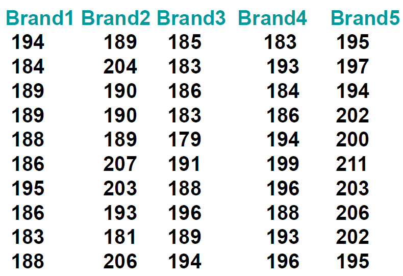
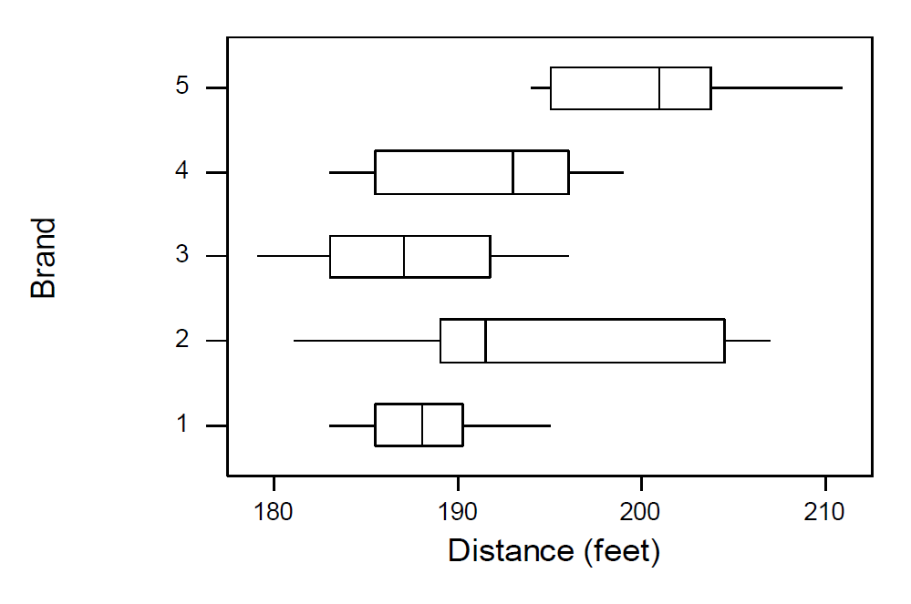
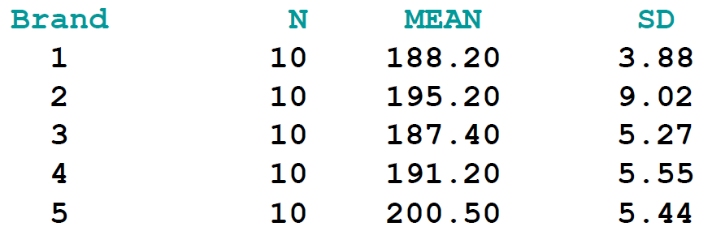
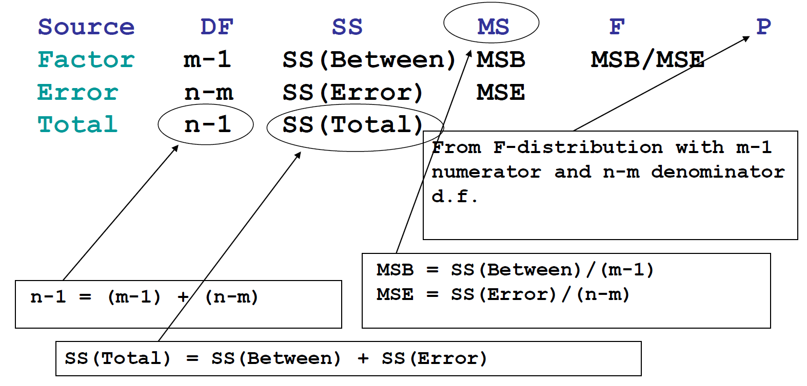
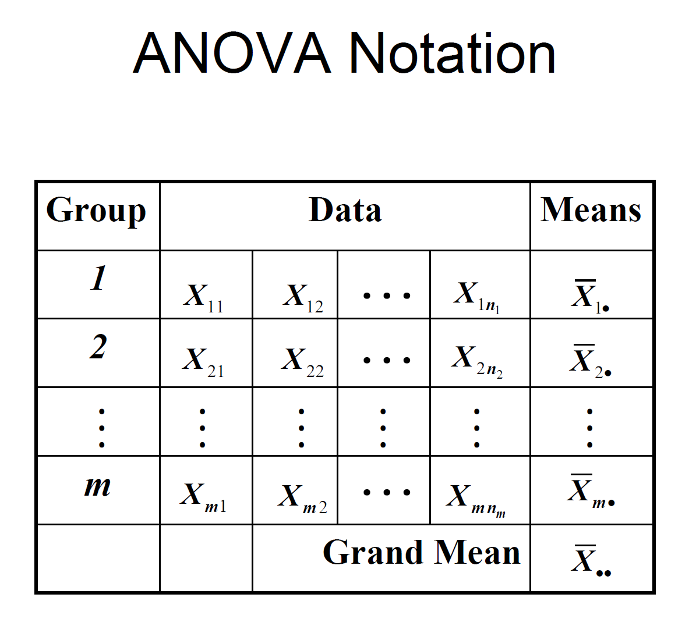

# **Analysis of Variance (ANOVA)**  

## **Overview**  

### **What is ANOVA?**  
**Analysis of Variance (ANOVA)** is a statistical method used to compare the means of **three or more groups** to determine if there is a statistically significant difference between them. It is widely used in experimental design, business analytics, and scientific research.  

ANOVA is a **generalization** of the t-test, which compares means between only two groups. Instead of performing multiple t-tests (which increases the risk of Type I error), ANOVA tests whether at least one group mean is different from the others in a single test.

---

### **ANOVA and Regression Models**  
ANOVA is related to **regression models** because both methods analyze relationships between variables. However, there are key differences:  

- In **regression**, we typically model a relationship where a continuous **dependent variable** is predicted by one or more **continuous independent variables**.  
- In **ANOVA**, the independent variable (predictor) is categorical, and we are only testing for mean differences rather than predicting specific values.

ANOVA is often seen as a **special case of regression**, where categorical variables (factors) are used as independent variables in a regression-like analysis.

---

### **Dependent and Independent Variables in ANOVA**  
ANOVA examines the relationship between:  

- **Response Variable (Dependent Variable)**: The outcome we are measuring (e.g., test scores, sales revenue, blood pressure).  
- **Predictor Variable (Independent Variable)**: The categorical factor influencing the response variable (e.g., different teaching methods, different diet plans, different manufacturing processes).

For example:  
- If we are testing the effect of **three different fertilizers** on crop yield, then:  
  - **Dependent variable** = Crop yield (in kg)  
  - **Independent variable** = Type of fertilizer (Fertilizer A, Fertilizer B, Fertilizer C)

---

### **Key Principles of ANOVA in Regression**  
While ANOVA is related to regression, it follows two key principles that distinguish it:

1. **The Independent Variable is Qualitative (Categorical)**  
   - Unlike regression, which usually has numerical independent variables (e.g., age, temperature), ANOVA deals with categorical factors (e.g., different brands, treatments, or methods).  
   - Example: If we compare students' exam scores across **three different schools**, the independent variable ("School") is categorical, not numerical.

2. **No Assumption About Functional Relationship Between Response and Predictor**  
   - In regression, we assume a specific mathematical form (e.g., linear, polynomial) to describe the relationship between variables.  
   - ANOVA does not assume a functional relationship—it simply checks **if group means are significantly different**.

---

### **Hypothesis Testing in ANOVA**  
ANOVA is a hypothesis-testing method that determines whether the means of multiple groups are equal or significantly different. It does this by comparing the **variance within** each group to the **variance between** groups.  

The hypotheses tested in ANOVA are:

- **Null Hypothesis (\(H_0\))**:  
  - "All group means are equal."  
  - Mathematically:  
    \[
    H_0: \mu_1 = \mu_2 = \dots = \mu_k
    \]
  - This means there is no significant difference among the groups.

- **Alternative Hypothesis (\(H_1\))**:  
  - "At least one group mean is different."  
  - This does **not** mean all groups are different—just that at least one is significantly different from the others.  

For example, if we are comparing the effectiveness of three different study techniques on student performance, the hypotheses would be:

- **\(H_0\)**: All study techniques result in the same average score.  
- **\(H_1\)**: At least one study technique leads to a significantly different average score.

## **One-Way ANOVA**  

A **One-Way ANOVA** is a statistical test used to determine if the means of three or more independent groups are significantly different from each other.  

### **Case Example**  
We are analyzing whether the **stopping distance of a car at 60 mph** depends on the **tire brand**.  

- The **response variable** (dependent variable) = **Stopping distance (measured in feet/meters)**  
- The **predictor variable** (independent variable) = **Tire brand (categorical: Brand A, Brand B, etc.)**  

### **Hypotheses**  
- **Null Hypothesis (\(H_0\))**: All tire brands have the same mean stopping distance.  
- **Alternative Hypothesis (\(H_1\))**: At least one tire brand has a different mean stopping distance.

---

### **Understanding the ANOVA Table**  
The given ANOVA table provides the breakdown of how the total variation in stopping distance is split into two sources:  

| Source | DF | SS | MS | F | P |
|-|-|-|-|-|-|
| **Brand** | 4 | 1174.8 | 293.7 | 7.95 | 0.000 |
| **Error** | 45 | 1661 | 36.9 |
| **Total** | 49 | 2836.5 |

Let’s define each term and explain how these values are calculated.

---

#### **1. Source (Variation Source)**
In ANOVA, the total variation in the data is divided into two components:  

- **Between-Groups Variation (Factor Effect) → "Brand"**  
  - This represents the variation **caused by differences among the means of different groups** (tire brands).  
  - If there is a large variation between brands, it suggests that the brand impacts stopping distance.  
  - Also called **"Treatment" variance** or **"Explained" variance**.  

- **Within-Groups Variation (Random Error) → "Error"**  
  - This represents variation **within each group** (individual differences, measurement errors, etc.).  
  - Also called **"Residual" variance** or **"Unexplained" variance**.

- **Total Variation → "Total"**  
  - The total variation in stopping distances, combining both between-group and within-group variations.  
  - It is simply the sum of **Brand SS** and **Error SS**.

---

#### **2. Degrees of Freedom (DF)**
Degrees of freedom represent the number of independent pieces of information available to estimate statistical parameters.

- **DF (Brand)** = \( k - 1 \)  
  - Where **\( k \)** is the number of groups (tire brands).  
  - Since we have **5 tire brands (\( k = 5 \))**, the DF for the brand is:  
    \[
    DF_{\text{Brand}} = 5 - 1 = 4
    \]

- **DF (Error)** = \( N - k \)  
  - Where **\( N \)** is the total number of observations.  
  - Given **\( N = 50 \) (total observations across all brands)** and **\( k = 5 \)**:  
    \[
    DF_{\text{Error}} = 50 - 5 = 45
    \]

- **DF (Total)** = \( N - 1 \)  
  - \[
    DF_{\text{Total}} = 50 - 1 = 49
    \]
  - Always **DF (Total) = DF (Brand) + DF (Error)**.

---

#### **3. Sum of Squares (SS)**
Sum of Squares measures the **total variation** in the data.  

- **SS (Brand)** = The sum of squared differences between each group mean and the overall mean.
  - Given in the table as **1174.8**.  
  - Formula:  
    \[
    SS_{\text{Brand}} = \sum n_i (\bar{X_i} - \bar{X})^2
    \]
    where:  
    - \( n_i \) = sample size for group \( i \)  
    - \( \bar{X_i} \) = mean of group \( i \)  
    - \( \bar{X} \) = overall mean  

- **SS (Error)** = The sum of squared differences within each group.
  - Given in the table as **1661**.
  - Formula:  
    \[
    SS_{\text{Error}} = \sum (X_{ij} - \bar{X_i})^2
    \]
    where:  
    - \( X_{ij} \) = individual observations in group \( i \)  
    - \( \bar{X_i} \) = mean of group \( i \)  

- **SS (Total)** = The total variation in the dataset.  
  - Given in the table as **2836.5**.
  - Formula:  
    \[
    SS_{\text{Total}} = SS_{\text{Brand}} + SS_{\text{Error}}
    \]

---

#### **4. Mean Square (MS)**
Mean Square is the **variance estimate** and is obtained by dividing SS by DF.  

- **MS (Brand)** = \( SS_{\text{Brand}} / DF_{\text{Brand}} \)  
  - \[
    MS_{\text{Brand}} = \frac{1174.8}{4} = 293.7
    \]

- **MS (Error)** = \( SS_{\text{Error}} / DF_{\text{Error}} \)  
  - \[
    MS_{\text{Error}} = \frac{1661}{45} = 36.9
    \]

---

#### **5. F-Statistic (F)**
The **F-statistic** tests whether the group means are significantly different.  
- Formula:  
  \[
  F = \frac{MS_{\text{Brand}}}{MS_{\text{Error}}}
  \]
- Calculation:  
  \[
  F = \frac{293.7}{36.9} = 7.95
  \]
- A higher **F-value** indicates a greater chance that at least one group mean is different.

---

#### **6. p-Value (P)**
The **p-value** tells us whether the observed difference is statistically significant.  
- If **p < 0.05**, we reject \( H_0 \) and conclude that **at least one group mean is significantly different**.  
- Given in the table as **0.000**, which is **much lower than 0.05**, meaning we **reject \( H_0 \)**.  
- This suggests that at least one tire brand has a significantly different stopping distance.

---

#### **Final Interpretation**
- The p-value **(0.000)** suggests a **statistically significant** difference in stopping distances between tire brands.  
- The **F-statistic (7.95)** is large, further confirming that the difference is **unlikely due to random chance**.  
- Since **\( H_0 \) is rejected**, we conclude that at least one tire brand results in a different stopping distance compared to others.  

---

#### **Summary of How Each Value is Calculated**
| Term | Meaning | Formula |
|-|-|-|
| **Source** | Source of variation (Brand = Between-group, Error = Within-group) | - |
| **DF** | Degrees of Freedom | \( DF_{\text{Brand}} = k - 1 \), \( DF_{\text{Error}} = N - k \), \( DF_{\text{Total}} = N - 1 \) |
| **SS** | Sum of Squares | \( SS_{\text{Brand}} = \sum n_i (\bar{X_i} - \bar{X})^2 \), \( SS_{\text{Error}} = \sum (X_{ij} - \bar{X_i})^2 \) |
| **MS** | Mean Square | \( MS = SS / DF \) |
| **F** | F-statistic | \( F = MS_{\text{Brand}} / MS_{\text{Error}} \) |
| **P** | p-value | From F-distribution table |

#### ANOVA Notation

The table shown provides a structured notation used in **Analysis of Variance (ANOVA)** to represent data, group means, and the overall mean (Grand Mean).  

##### **Notation Breakdown**  

###### **1. Groups (Rows)**
- The **first column** represents different **groups or categories** in the dataset (e.g., different brands of tires, different teaching methods, etc.).
- Each group is indexed as **\( i \)** (e.g., 1, 2, ..., \( m \)).
- The total number of groups is represented by **\( m \)**.

###### **2. Data Points (Middle Columns)**
- Each **cell in the table** represents an individual data point from a particular group.
- The notation **\( X_{ij} \)** is used:
  - **\( X_{ij} \)** refers to the \( j \)-th observation in the \( i \)-th group.
  - Example: **\( X_{12} \)** is the 2nd observation in Group 1.
- The number of observations in Group \( i \) is denoted as **\( n_i \)**.

###### **3. Group Means (Last Column)**
- The **mean of each group** is represented by **\( \bar{X}_{i.} \)**.
- The dot ( **·** ) in the subscript represents **averaging over all observations within a group**.
- Formula for the mean of group \( i \):  
  \[
  \bar{X}_{i.} = \frac{1}{n_i} \sum_{j=1}^{n_i} X_{ij}
  \]
  where:
  - \( n_i \) = number of observations in group \( i \)
  - \( X_{ij} \) = individual observations in group \( i \)

###### **4. Grand Mean (Bottom Row)**
- The **Grand Mean** ( \( \bar{X}_{..} \) ) is the overall mean of all data points across all groups.
- Formula:  
  \[
  \bar{X}_{..} = \frac{1}{N} \sum_{i=1}^{m} \sum_{j=1}^{n_i} X_{ij}
  \]
  where:
  - \( N \) is the total number of observations in all groups combined.
  - \( X_{ij} \) are the individual observations.

---

##### **Summary**
| Symbol | Meaning |
|--------|---------|
| \( X_{ij} \) | Individual data point in group \( i \), observation \( j \). |
| \( \bar{X}_{i.} \) | Mean of group \( i \) (averaging over all observations in that group). |
| \( \bar{X}_{..} \) | Grand Mean (mean of all data points from all groups). |
| \( n_i \) | Number of observations in group \( i \). |
| \( m \) | Total number of groups. |
| \( N \) | Total number of observations across all groups. |

This notation is essential for computing the **Sum of Squares (SS)**, **Mean Square (MS)**, and the **F-statistic** in ANOVA calculations.

### **Total Sum of Squares (SS(TO))**  

The **Total Sum of Squares (SS(TO))** is a key component in ANOVA, representing the total variability in the dataset. It measures how much each data point deviates from the **grand mean** ( \( \bar{X}_{..} \) ).  

---

#### **1. Definition of SS(TO)**
\[
SS(TO) = \sum_{i=1}^{m} \sum_{j=1}^{n_i} (X_{ij} - \bar{X}_{..})^2
\]
- This formula calculates the **total variation** in the dataset.
- It sums the squared differences between each observation \( X_{ij} \) and the **grand mean** \( \bar{X}_{..} \).
- The more spread out the data, the **higher** the SS(TO) value.

---

#### **2. Expanded Form**
\[
SS(TO) = \sum_{i=1}^{m} \sum_{j=1}^{n_i} (X_{ij}^2 - 2X_{ij} \bar{X}_{..} + \bar{X}_{..}^2)
\]
By expanding the squared term, we break it into three parts:
- \( X_{ij}^2 \) → The squared values of each data point.
- \( -2X_{ij} \bar{X}_{..} \) → A term accounting for how each observation relates to the grand mean.
- \( \bar{X}_{..}^2 \) → The squared grand mean, applied to all data points.

Rewriting the equation:
\[
SS(TO) = \sum_{i=1}^{m} \sum_{j=1}^{n_i} X_{ij}^2 - 2\bar{X}_{..} \sum_{i=1}^{m} \sum_{j=1}^{n_i} X_{ij} + n \bar{X}_{..}^2
\]
where:
- \( n \) is the total number of observations.

---

#### **3. Shortcut Formula**
\[
SS(TO) = \sum_{i=1}^{m} \sum_{j=1}^{n_i} X_{ij}^2 - n \bar{X}_{..}^2
\]
This formula provides a faster way to calculate **SS(TO)**:
- Compute the sum of squares of all data points: \( \sum X_{ij}^2 \).
- Compute the total number of observations **\( n \)** and multiply by the squared grand mean \( \bar{X}_{..}^2 \).
- Subtract \( n \bar{X}_{..}^2 \) from the total sum of squares.

---

#### **Interpretation of SS(TO)**
- The **larger** the value of SS(TO), the **greater the variability** in the data.
- This measure is later **partitioned** into:
  - **SS(Between Groups) (SS(B))** → Variation due to differences between groups.
  - **SS(Within Groups) (SS(W))** → Variation within individual groups.

\[
SS(TO) = SS(B) + SS(W)
\]

### **Treatment Sum of Squares (SS(T))**  

The **Treatment Sum of Squares (SS(T))**, also known as **Between-Groups Sum of Squares**, measures the variation **between** different groups in an ANOVA test. It quantifies how much the group means deviate from the **grand mean**.

---

#### **1. Definition of SS(T)**
\[
SS(T) = \sum_{i=1}^{m} n_i (\bar{X}_{i.} - \bar{X}_{..})^2
\]
- **\( n_i \)** = Number of observations in group \( i \).  
- **\( \bar{X}_{i.} \)** = Mean of group \( i \).  
- **\( \bar{X}_{..} \)** = Grand mean (overall mean of all observations).  

This formula calculates the weighted squared differences between **each group's mean** and the **grand mean**.

---

#### **2. Expanded Form**
\[
SS(T) = \sum_{i=1}^{m} n_i (\bar{X}_{i.}^2 - 2\bar{X}_{i.} \bar{X}_{..} + \bar{X}_{..}^2)
\]
By expanding the squared term, we break it down into three parts:
1. **\( n_i \bar{X}_{i.}^2 \)** → The squared mean of each group multiplied by its sample size.
2. **\( -2n_i \bar{X}_{i.} \bar{X}_{..} \)** → Adjusts for the relationship between each group mean and the grand mean.
3. **\( n_i \bar{X}_{..}^2 \)** → The squared grand mean multiplied by the sample size.

Rewriting the equation:
\[
SS(T) = \sum_{i=1}^{m} n_i \bar{X}_{i.}^2 - 2\bar{X}_{..} \sum_{i=1}^{m} n_i \bar{X}_{i.} + \bar{X}_{..}^2 \sum_{i=1}^{m} n_i
\]
Since the sum of all \( n_i \) is the total sample size \( n \), this simplifies further.

---

#### **3. Shortcut Formula**
\[
SS(T) = \sum_{i=1}^{m} n_i \bar{X}_{i.}^2 - n \bar{X}_{..}^2
\]
This shortcut formula provides a faster way to compute **SS(T)**:
1. Compute the **sum of squared means** of each group multiplied by their respective sample sizes.
2. Compute the **total number of observations** \( n \) and multiply it by the **grand mean squared**.
3. Subtract the second term from the first.

---

#### **Interpretation of SS(T)**
- **SS(T) represents the variation among the different groups.**
- A **large** SS(T) suggests that the groups have significantly different means.
- A **small** SS(T) suggests that the group means are similar, meaning little variation between them.

In ANOVA, SS(T) is part of the equation:
\[
SS(T) + SS(W) = SS(TO)
\]
where:
- **SS(T) (Between-Group Variance)** measures variation **between** groups.
- **SS(W) (Within-Group Variance)** measures variation **inside** each group.
- **SS(TO) (Total Variance)** represents the total variability in the dataset.

---

#### **Why is SS(T) Important?**
- SS(T) helps determine whether **group differences** are significant.
- It is used to compute the **F-statistic**, which is crucial for hypothesis testing in ANOVA.

### **Error Sum of Squares (SS(E))**  

The **Error Sum of Squares (SS(E))**, also known as **Within-Groups Sum of Squares**, measures the variability **within each group** in an ANOVA test. It quantifies how much individual observations **deviate from their group mean**.

---

#### **1. Definition of SS(E)**  
\[
SS(E) = \sum_{i=1}^{m} \sum_{j=1}^{n_i} (X_{ij} - \bar{X}_{i.})^2
\]
- **\( X_{ij} \)** = Individual observation in group \( i \).  
- **\( \bar{X}_{i.} \)** = Mean of group \( i \).  
- **\( n_i \)** = Number of observations in group \( i \).  
- **\( m \)** = Number of groups.

This formula calculates the sum of squared deviations of **each observation from its respective group mean**. The larger the SS(E), the more spread out the data points are within each group.

---

#### **2. Shortcut Formula**
\[
SS(E) = SS(TO) - SS(T)
\]
This shortcut states that the **Error Sum of Squares** can be obtained by subtracting the **Treatment Sum of Squares (SS(T))** from the **Total Sum of Squares (SS(TO))**.

\[
SS(TO) = SS(T) + SS(E)
\]
This relationship holds because:
- **SS(TO) (Total Variance)** = The overall variance in the dataset.
- **SS(T) (Between-Group Variance)** = The variance due to differences between groups.
- **SS(E) (Within-Group Variance)** = The variance due to differences **inside** each group.

---

#### **3. Interpretation of SS(E)**
- **SS(E) measures how much the data points vary within each group.**
- A **small** SS(E) suggests that **data points within each group are close to the group mean**.
- A **large** SS(E) suggests that **data points within each group are highly variable**.

In ANOVA, SS(E) is used to compute the **Mean Square Error (MSE)**:
\[
MSE = \frac{SS(E)}{\text{degrees of freedom}}
\]
which is critical for testing the significance of differences between group means.

---

#### **Why is SS(E) Important?**
- It **quantifies the noise** or unexplained variation in the data.
- It is used to calculate the **F-statistic** in ANOVA, which determines if the differences between groups are significant.

### **SS(TO) = SS(T) + SS(E)**  

This equation represents the **decomposition of total variation** in an ANOVA (Analysis of Variance). It states that the **Total Sum of Squares (SS(TO))** can be broken down into:  
1. **Treatment Sum of Squares (SS(T))** – variation due to differences **between groups**.  
2. **Error Sum of Squares (SS(E))** – variation due to differences **within groups** (random error).  

---

#### **1. Definition of Total Sum of Squares (SS(TO))**
\[
SS(TO) = \sum_{i=1}^{m} \sum_{j=1}^{n_i} (X_{ij} - \bar{X}_{..})^2
\]
- **\( SS(TO) \)** measures the total variation in the dataset.
- **\( X_{ij} \)** = Individual observation.
- **\( \bar{X}_{..} \)** = Overall mean of all data points.

---

#### **2. Derivation of SS(TO) = SS(T) + SS(E)**  
Using the identity:
\[
X_{ij} - \bar{X}_{..} = (X_{ij} - \bar{X}_{i.}) + (\bar{X}_{i.} - \bar{X}_{..})
\]
where:
- **\( X_{ij} - \bar{X}_{i.} \)** = The deviation of an individual observation from its group mean (**within-group variation**).
- **\( \bar{X}_{i.} - \bar{X}_{..} \)** = The deviation of the group mean from the overall mean (**between-group variation**).

Expanding the squared term:
\[
(X_{ij} - \bar{X}_{..})^2 = (X_{ij} - \bar{X}_{i.})^2 + 2(X_{ij} - \bar{X}_{i.})(\bar{X}_{i.} - \bar{X}_{..}) + (\bar{X}_{i.} - \bar{X}_{..})^2
\]
Summing over all data points:
\[
SS(TO) = \sum_{i=1}^{m} \sum_{j=1}^{n_i} (X_{ij} - \bar{X}_{i.})^2 + 2\sum_{i=1}^{m} \sum_{j=1}^{n_i} (X_{ij} - \bar{X}_{i.})(\bar{X}_{i.} - \bar{X}_{..}) + \sum_{i=1}^{m} \sum_{j=1}^{n_i} (\bar{X}_{i.} - \bar{X}_{..})^2
\]
The **middle term sums to zero** due to the properties of means, simplifying to:
\[
SS(TO) = SS(E) + SS(T)
\]
where:
- **\( SS(T) = \sum_{i=1}^{m} n_i (\bar{X}_{i.} - \bar{X}_{..})^2 \)** (Between-group variation).
- **\( SS(E) = \sum_{i=1}^{m} \sum_{j=1}^{n_i} (X_{ij} - \bar{X}_{i.})^2 \)** (Within-group variation).

---

#### **3. Interpretation of SS(TO) = SS(T) + SS(E)**
- **\( SS(TO) \)** represents the **total variability** in the dataset.
- **\( SS(T) \)** captures the **systematic variation** due to treatment (group differences).
- **\( SS(E) \)** represents **random error or unexplained variation**.

#### **Key Takeaways**
1. **If SS(T) is large** compared to SS(E), then treatment effects are significant.
2. **If SS(E) is large**, then individual variability within groups dominates, making it harder to detect treatment effects.
3. This decomposition is fundamental in ANOVA to compute the **F-statistic**:
   \[
   F = \frac{\text{Mean Square Treatment (MST)}}{\text{Mean Square Error (MSE)}}
   \]
   where:
   \[
   MST = \frac{SS(T)}{\text{df}_T}, \quad MSE = \frac{SS(E)}{\text{df}_E}
   \]
