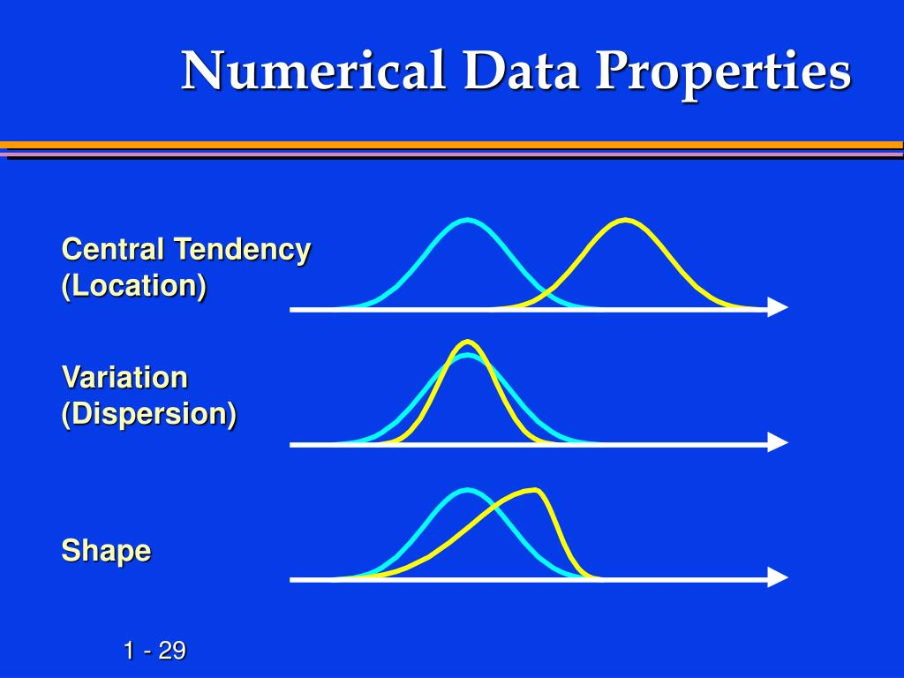

# **Exploratory Data Analysis (EDA)**

## **Introduction**

Exploratory Data Analysis (EDA) is a crucial step in the data analysis process that focuses on examining and summarizing datasets to uncover patterns, detect anomalies, test hypotheses, and check assumptions. It provides insights into the structure of the data and lays the groundwork for advanced statistical analyses or predictive modeling.

* * *

## **Key Objectives of EDA**

1.  **Understand the Data Structure:**
    
    - Explore variables, their types, and relationships to better understand the dataset.
2.  **Identify Patterns and Trends:**
    
    - Detect recurring patterns, trends, or distributions within the dataset.
3.  **Detect Anomalies and Outliers:**
    
    - Identify unusual or extreme data points that could influence the analysis or model.
4.  **Check Data Quality:**
    
    - Ensure the dataset is complete, accurate, and consistent by identifying missing values, duplicates, or errors.
5.  **Prepare for Further Analysis:**
    
    - Develop hypotheses, choose appropriate statistical methods, and determine feature importance.

* * *

## **Steps in EDA**

1.  **Data Collection and Loading:**
    
    - Obtain and load the dataset into tools like Python, R, or Excel.
2.  **Data Cleaning:**
    
    - Handle missing data, outliers, and duplicates.
3.  **Univariate Analysis:**
    
    - Analyze individual variables using descriptive statistics and visualizations like histograms or bar plots.
4.  **Bivariate and Multivariate Analysis:**
    
    - Explore relationships between two or more variables using scatter plots, correlation matrices, or heatmaps.
5.  **Statistical Summarization:**
    
    - Summarize central tendencies (mean, median) and dispersions (range, standard deviation).
6.  **Data Visualization:**
    
    - Use charts and plots (e.g., boxplots, pair plots) to visually interpret data patterns.
7.  **Feature Engineering:**
    
    - Create or modify variables for better representation of the data.

* * *

#### **Techniques and Tools**

- **Visualization Tools:**
    
    - *Matplotlib*, *Seaborn* (Python), *ggplot2* (R), Tableau.
- **Statistical Summaries:**
    
    - Mean, median, mode, variance, and skewness.
- **Correlation Analysis:**
    
    - Evaluate linear relationships between variables.

* * *

EDA is an iterative process that guides analysts to refine hypotheses and make informed decisions.

* * *

## **Summarizing Variables**

This topic focuses on representing data effectively, based on the type of variable—either **categorical** or **continuous**. The goal is to summarize the data in a way that is clear, informative, and visually interpretable.

* * *

### **1\. Categorical Variables**

Categorical variables represent data divided into distinct groups or categories. Examples include gender, marital status, or types of vehicles. Here’s how these variables are summarized:

#### **a. Frequency Tables**

A **Frequency Table** lists each category alongside the count of observations in that category. It provides a straightforward numerical summary of how data is distributed across categories.

#### **b. Relative Frequency Tables**

Relative frequencies provide the proportion or percentage of observations in each category, calculated as:

$$
\text{Relative Frequency} = \frac{\text{Frequency of a category}}{\text{Total number of observations}} 
$$

This table is helpful for comparing categories as proportions rather than raw counts.

#### **c. Bar Charts**

Bar charts use rectangular bars to represent the frequency or relative frequency of each category. Key characteristics:

- Categories are on the x-axis.
- Frequencies or proportions are on the y-axis.
- Bars are spaced apart to emphasize distinct categories.

#### **d. Other Plots**

Apart from bar charts, other visualizations for categorical variables include:

- **Pie Charts:** Represent proportions as segments of a circle.
- **Pareto Charts:** A bar chart sorted by frequency, often combined with a cumulative frequency line.

* * *

### **2\. Continuous Variables**

Continuous variables represent measurements or quantities that can take an infinite range of values within a given interval. Examples include height, weight, or temperature. Here’s how continuous variables are summarized:

#### **a. Binning Observations**

Binning involves grouping continuous data into intervals (bins) and treating them as ordered categorical data. Steps include:

1.  Divide the range of data into intervals.
2.  Count the number of observations in each bin.
3.  Summarize using a frequency table or histogram.

Example: Height (in cm) could be binned into intervals like 150-159, 160-169, etc.

#### **b. Plots Specific to Continuous Variables**

Common visualizations for continuous variables include:

- **Histograms:** Display the frequency of data within intervals (bins). Bars touch each other to indicate the continuity of the variable.
- **Boxplots:** Show the distribution's median, quartiles, and potential outliers.
- **Density Plots:** A smoothed version of the histogram, representing the probability density function of the data.

* * *

### **Goals of Summarizing Variables**

The main objective of summarizing variables is to simplify data representation while retaining its essential characteristics. This process helps in understanding, interpreting, and communicating data more effectively. Here are the specific goals:

* * *

#### **1\. Data Exploration**

- **Gain Insights:** Summarizing variables allows researchers to grasp the overall patterns and trends in data.
- **Identify Outliers:** Detecting unusual or extreme values in data becomes easier, ensuring better decisions.

* * *

#### **2\. Data Presentation**

- **Improve Clarity:** Summaries make complex datasets accessible and understandable to a wider audience.
- **Support Visualization:** Techniques like frequency tables, histograms, or bar charts create a clear visual interpretation of data.

* * *

#### **3\. Simplify Analysis**

- **Reduce Complexity:** Summarization condenses vast datasets into manageable forms, focusing on the most relevant information.
- **Facilitate Decision-Making:** Decision-making becomes more straightforward when key statistics like means or proportions are readily available.

* * *

#### **4\. Statistical Modeling and Hypothesis Testing**

- Summarizing variables is an essential step in ensuring accurate inputs for advanced statistical analyses or predictive modeling.

* * *

## **Univariate Analysis**

Univariate analysis involves examining and summarizing a single variable to understand its distribution and key characteristics.

* * *

### **1\. Measures of Location**

Measures of location, also known as central tendency, summarize where most values in the dataset are situated. These measures provide an average or typical value.

- **Mean (Arithmetic Average):** The sum of all values divided by the number of observations. It is sensitive to outliers.
- **Median:** The middle value when data is sorted in ascending order. It is robust to outliers.
- **Mode:** The value that occurs most frequently in the dataset. Useful for categorical or bimodal data.
- **Percentiles:** Divides data into 100 equal parts. The 50th percentile is equivalent to the median.
- **Quartiles:** Specific percentiles (25th, 50th, 75th) that divide data into four equal parts.

* * *

### **2\. Measures of Variability**

These measures indicate the spread or dispersion of data, describing how much variability exists.

- **Range:** The difference between the maximum and minimum values.
- **Variance:** The average squared deviation of data points from the mean, showing how spread out data is.
- **Standard Deviation:** The square root of variance, providing dispersion in the same units as the data.
- **Interquartile Range (IQR):** The range between the 25th (Q1) and 75th (Q3) percentiles, measuring the spread of the middle 50% of the data.
- **Coefficient of Variation (CV):** The ratio of the standard deviation to the mean, expressed as a percentage.

* * *

#### **3\. Measures of Heterogeneity**

Heterogeneity measures describe diversity within a dataset. These are particularly useful in categorical data or proportions.

- **Entropy:** Quantifies randomness or uncertainty in a dataset. High entropy indicates greater diversity.
- **Simpson’s Index:** Measures the probability that two randomly selected individuals belong to the same category. Lower values indicate more heterogeneity.
- **Gini Index:** Measures inequality or disparity in data distribution.

* * *

### **4\. Measures of Concentration**

These measures evaluate the degree to which data points are concentrated in specific areas of the dataset.

- **Lorenz Curve:** A graphical representation of data concentration, often paired with the Gini Index.
- **Concentration Ratio:** Measures the proportion of total values accounted for by the largest k categories or observations.
- **Herfindahl-Hirschman Index (HHI):** A measure of market concentration used in economics, calculated as the sum of squared shares of categories.

* * *

### **5\. Measures of Asymmetry**

Asymmetry measures the degree to which a distribution deviates from being symmetric.

- **Skewness:** Quantifies the asymmetry of a data distribution.
    - Positive Skew: Long tail on the right.
    - Negative Skew: Long tail on the left.

Mathematically, skewness is expressed as:

$$
\text{Skewness} = \frac{\frac{1}{n} \sum_{i=1}^{n} (x_i - \bar{x})^3}{\sigma^3}
$$

where ( x_i ) are data points, ( \\bar{x} ) is the mean, and ( \\sigma ) is the standard deviation.

* * *

### **6\. Measures of Kurtosis**

Kurtosis measures the "tailedness" of a distribution, indicating how extreme the outliers are.

- **Leptokurtic (Kurtosis > 3):** Heavy tails and peaked distribution.
- **Mesokurtic (Kurtosis ≈ 3):** Normal tail behavior, typical of a normal distribution.
- **Platykurtic (Kurtosis < 3):** Light tails and flatter distribution.

Mathematically, kurtosis is expressed as:

$$
\text{Kurtosis} = \frac{\frac{1}{n} \sum_{i=1}^{n} (x_i - \bar{x})^4}{\sigma^4} - 3
$$

The "-3" ensures that the kurtosis of a normal distribution is zero.

* * *

Let me know if you'd like deeper insights into any specific measure or if you'd like this explanation supplemented with examples or visualizations!

### **Numerical Data Properties**

Numerical data, also referred to as quantitative data, represents measurable quantities and can be analyzed using a wide range of statistical methods. Understanding its properties is crucial for effective data summarization, exploration, and modeling.

* * *

#### **1\. Types of Numerical Data**

Numerical data can be broadly categorized into:

- **Discrete Data:**
    - Consists of countable values (e.g., number of students in a class).
    - Takes whole numbers and is often finite.
- **Continuous Data:**
    - Can take any value within a range (e.g., height, weight, temperature).
    - Includes fractions and decimals, often representing measurements.

* * *

#### **2\. Key Properties of Numerical Data**

Here are the core properties used to describe and analyze numerical data:

##### **a. Central Tendency**

Central tendency reflects the central or typical value in a dataset. The measures include:

- **Mean:** Arithmetic average of data points.
- **Median:** Middle value when data is ordered.
- **Mode:** Most frequently occurring value.

##### **b. Variability**

Variability describes how spread out data points are. Common measures include:

- **Range:** Difference between the maximum and minimum values.
- **Variance and Standard Deviation:** Indicate the average degree to which data deviates from the mean.
- **Interquartile Range (IQR):** Measures the range of the middle 50% of data.

##### **c. Shape of the Distribution**

The distribution's shape provides insights into the arrangement of data values:

- **Skewness:** Measures asymmetry of the distribution (positive, negative, or symmetric).
- **Kurtosis:** Measures the "tailedness" or extreme value behavior of the distribution (leptokurtic, mesokurtic, platykurtic).

##### **d. Scale**

The scale of numerical data determines the level of precision and units of measurement:

- Examples: Time (seconds, minutes), Distance (meters, kilometers), Weight (grams, kilograms).

* * *

#### **3\. Relationships Between Numerical Variables**

When analyzing two or more numerical variables, relationships can be explored using:

- **Covariance:** Indicates the direction of the linear relationship.
- **Correlation Coefficient:** Measures the strength and direction of the linear relationship, ranging from -1 to +1.
- **Scatter Plots:** Visualize the relationship between two numerical variables.
- **Regression Analysis:** Estimates relationships and dependencies.

* * *

#### **4\. Data Transformations**

Transformations are often applied to numerical data for normalization, scaling, or better interpretability:

- **Log Transform:** Reduces skewness in highly skewed data.
- **Standardization (Z-scores):** Centers data around a mean of 0 with a standard deviation of 1.
- **Min-Max Scaling:** Rescales data to a fixed range, often \[0, 1\].

* * *

#### **5\. Applications of Numerical Data Properties**

- **Descriptive Statistics:** Summarizes data with key metrics and visualizations.
- **Inferential Statistics:** Generalizes findings from a sample to a population.
- **Predictive Modeling:** Develops algorithms to predict outcomes based on numerical inputs.

* * *

### **Central Tendency (Location)**

Central tendency provides a measure to summarize a dataset with a single value that represents the center or typical value of the data distribution. Below are detailed explanations of the methods you’ve listed:

* * *

#### **1\. Mean**

The **mean** is the most commonly used measure of central tendency and represents the average of the data.

##### **a. Arithmetic Mean**

The **Arithmetic Mean** is calculated as the sum of all data points divided by the number of observations. It is sensitive to outliers and best used for symmetrical distributions.

Formula:

$$
\text{Arithmetic Mean} (\bar{x}) = \frac{\sum_{i=1}^{n} x_i}{n}
$$

Where ( x_i ) are the data points and ( n ) is the total number of observations.

##### **b. Geometric Mean**

The **Geometric Mean** is the ( n )-th root of the product of all data points, used primarily for multiplicative datasets like growth rates.

Formula:

$$
\text{Geometric Mean} = \left( \prod_{i=1}^{n} x_i \right)^{\frac{1}{n}}
$$

It is less sensitive to outliers compared to the arithmetic mean.

##### **c. Harmonic Mean**

The **Harmonic Mean** is the reciprocal of the arithmetic mean of the reciprocals of data points. It is useful for rates or ratios, such as speed or efficiency.

Formula:

$$
\text{Harmonic Mean} = \frac{n}{\sum_{i=1}^{n} \frac{1}{x_i}}
$$

* * *

#### **2\. Median**

The **Median** is the middle value of a dataset when ordered in ascending or descending order. It is resistant to outliers, making it suitable for skewed data.

- **Odd Sample Size:** Median is the exact middle value.
- **Even Sample Size:** Median is the average of the two middle values.

* * *

#### **3\. Mode**

The **Mode** is the value that appears most frequently in the dataset. It is particularly useful for categorical or nominal data.

- **Unimodal:** Single mode.
- **Bimodal:** Two modes.
- **Multimodal:** More than two modes.

For example, in the dataset {2, 3, 3, 4, 5}, the mode is 3.

* * *

#### **4\. Midrange**

The **Midrange** is the average of the maximum and minimum values in the dataset. It provides a rough measure of central tendency but is highly sensitive to outliers.

Formula:

$$
\text{Midrange} = \frac{\text{Minimum Value} + \text{Maximum Value}}{2}
$$

* * *

#### **5\. Midhinge**

The **Midhinge** is the average of the first and third quartiles (Q1 and Q3), effectively summarizing the center of the interquartile range.

Formula:

$$
\text{Midhinge} = \frac{Q1 + Q3}{2}
$$

* * *

These measures help describe data’s central position, each with its specific advantages depending on the dataset's nature and distribution.

#### **Variation (Dispersion)**

Variation, or dispersion, measures how data points in a dataset are spread out. These measures help quantify the degree to which individual values deviate from the central tendency. Below is a comprehensive explanation of the listed measures:

* * *

##### **1\. Range**

The **Range** is the simplest measure of dispersion, representing the difference between the largest and smallest values in a dataset.

Formula:

$$
\text{Range} = \text{Maximum Value} - \text{Minimum Value}
$$

- **Advantages:** Easy to calculate and provides a quick sense of data spread.
- **Disadvantages:** Highly sensitive to outliers, as it considers only the extremes.

* * *

##### **2\. Interquartile Range (IQR)**

The **Interquartile Range (IQR)** measures the spread of the middle 50% of the data, making it robust to outliers. It is calculated as the difference between the first quartile (Q1) and the third quartile (Q3).

Formula:

$$
\text{IQR} = Q3 - Q1
$$

- **Uses:** IQR is often used to identify outliers, which are values below ( Q1 - 1.5 \\times \\text{IQR} ) or above ( Q3 + 1.5 \\times \\text{IQR} ).

* * *

##### **3\. Variance**

The **Variance** quantifies the average squared deviation of each data point from the mean. It is a fundamental concept in statistics and is central to many analyses.

Formula (Population Variance):

$$
\sigma^2 = \frac{\sum_{i=1}^{N} (x_i - \mu)^2}{N}
$$

Formula (Sample Variance):

$$
s^2 = \frac{\sum_{i=1}^{n} (x_i - \bar{x})^2}{n - 1}
$$

Where:

- ( x_i ): Individual data points
    
- ( \\mu ): Population mean
    
- ( \\bar{x} ): Sample mean
    
- ( N ): Population size
    
- ( n ): Sample size
    
- **Advantages:** Provides a clear mathematical representation of dispersion.
    
- **Disadvantages:** Units are squared, which can make interpretation less intuitive.
    

* * *

##### **4\. Standard Deviation**

The **Standard Deviation (SD)** is the square root of the variance, expressed in the same units as the data. It is a widely used measure of dispersion.

Formula:

$$
\sigma = \sqrt{\sigma^2} \quad \text{(Population SD)}
$$

$$
s = \sqrt{s^2} \quad \text{(Sample SD)}
$$

- **Uses:** Standard deviation provides insight into how much individual data points deviate from the mean, and is essential for normal distribution analysis.

* * *

##### **5\. Coefficient of Variation (CV)**

The **Coefficient of Variation (CV)** expresses the standard deviation as a percentage of the mean, providing a relative measure of dispersion.

Formula:

$$
\text{CV} = \frac{\text{Standard Deviation}}{\text{Mean}} \times 100\%
$$

- **Advantages:** Useful for comparing variability across datasets with different units or scales.
    
- **Disadvantages:** Not meaningful when the mean is zero or close to zero.
    

* * *

These measures collectively provide valuable insights into the spread and distribution of data.

### **Normality**

Normality refers to the assumption or property of a dataset following a **normal distribution**. The normal distribution, also known as the **Gaussian distribution**, is a probability distribution that is symmetric and bell-shaped, centered around the mean. Understanding its key characteristics and associated measures is essential for statistical analysis.

* * *

#### **What is "Normal"?**

A normal distribution has the following features:

- **Symmetry:** The left and right sides of the distribution are mirror images.
- **Mean = Median = Mode:** In a perfectly normal distribution, these measures of central tendency are identical.
- **68-95-99.7 Rule (Empirical Rule):**
    - 68% of the data lies within 1 standard deviation of the mean.
    - 95% lies within 2 standard deviations.
    - 99.7% lies within 3 standard deviations.

* * *

#### **Types of Normal Distributions**

Normal distributions can be classified based on their kurtosis, which measures the "tailedness" of a distribution. While all are symmetric, their shapes vary due to differences in tail behavior:

1.  **Mesokurtic:**
    
    - Represents the classic normal distribution.
    - Kurtosis ≈ 3 (or adjusted kurtosis = 0).
    - Tails are neither heavy nor light, and peak height is moderate.
2.  **Platokurtic:**
    
    - Flatter peak with lighter tails compared to normal distribution.
    - Kurtosis < 3 (or adjusted kurtosis < 0).
    - Data is more evenly spread out.
3.  **Leptokurtic:**
    
    - Sharper peak with heavier tails than the normal distribution.
    - Kurtosis > 3 (or adjusted kurtosis > 0).
    - Indicates a greater likelihood of extreme values or outliers.

* * *

#### **Confidence Interval**

A **confidence interval** represents a range of values derived from a sample, within which the population parameter (e.g., mean) is likely to fall with a certain level of confidence (e.g., 95%).

- **Is it skewness?** No, confidence intervals and skewness are distinct concepts.
    - **Confidence Interval:** Deals with the estimation of parameters (e.g., mean) within a range.
    - **Skewness:** Measures the asymmetry of a distribution.

Formula (for mean, assuming normality):

$$
CI = \bar{x} \pm Z \times \frac{s}{\sqrt{n}}
$$

Where:

- ( \\bar{x} ): Sample mean
- ( Z ): Z-score corresponding to the confidence level (e.g., 1.96 for 95%)
- ( s ): Sample standard deviation
- ( n ): Sample size

* * *

#### **Point Estimation**

Point estimation involves estimating population parameters using a single value from a sample. Common estimators include:

1.  **Mean:** The arithmetic average.
2.  **Median:** The middle value when data is ordered.
3.  **Mode:** The most frequent value.
4.  **Trimmed Mean:** A robust mean calculation where a fixed percentage of extreme values (both ends) is removed before averaging.

* * *

#### **Deviation**

Deviation refers to measures of variability or dispersion in the data, indicating how far individual data points are from the central tendency:

1.  **Variance:**
    - Represents the average squared deviation from the mean.
    - Formula (Sample Variance):
        
        $$
        s^2 = \frac{\sum (x_i - \bar{x})^2}{n - 1}
        $$
        

* * *

This breakdown provides clarity on normality, distributions, and key statistical measures. Let me know if you'd like to explore these topics further!

### **Shape**

The **shape** of a data distribution describes the visual form of its frequency or probability plot. It helps in understanding the underlying characteristics of the data, such as symmetry, peakedness, and tail behavior.

* * *

#### **Measures of Shape**

Measures of shape provide quantitative insights into the symmetry and tail behavior of a distribution. Two important components of shape are **skewness** and **kurtosis**.

* * *

#### **1\. Skew**

Skewness measures the asymmetry of a distribution around its central value. Depending on its direction, a distribution can be:

- **Symmetric:** Skewness = 0 (e.g., normal distribution).
- **Positively Skewed (Right Skewed):** Tail extends to the right; skewness > 0.
- **Negatively Skewed (Left Skewed):** Tail extends to the left; skewness < 0.

Mathematically:

$$
\text{Skewness} = \frac{\frac{1}{n} \sum_{i=1}^{n} (x_i - \bar{x})^3}{\sigma^3}
$$

**Visualization:**  
The **Box and Whisker Plot** (shown in your notes) is an excellent tool for assessing skewness:

- A symmetric boxplot indicates no skewness.
- A longer whisker on one side indicates positive or negative skew.

* * *

#### **2\. Kurtosis**

Kurtosis measures the "tailedness" of a distribution—how extreme or frequent the outliers are. The three main categories are:

- **Mesokurtic:** Normal-tailed distribution (kurtosis ≈ 3).
- **Platykurtic:** Flatter peak, lighter tails (kurtosis < 3).
- **Leptokurtic:** Sharper peak, heavier tails (kurtosis > 3).

* * *

##### **a. Bell-Shaped Interval**

This refers to the classic bell shape of a normal distribution, where data is evenly distributed around the mean. Approximately:

- 68% of data lies within ±1 SD.
- 95% within ±2 SD.
- 99.7% within ±3 SD.

##### **b. Credible Interval**

A **credible interval** is a Bayesian probability concept that specifies the range where a parameter is likely to fall, given the data and prior distribution. It focuses on probability rather than confidence.

##### **c. Confidence Interval**

A **confidence interval** provides a frequentist approach, estimating the range where a parameter is likely to fall based on repeated sampling. For example, a 95% confidence interval means that 95 out of 100 samples will contain the true parameter.

* * *

#### **Confidence Interval vs. Credible Interval**

| **Aspect** | **Confidence Interval** | **Credible Interval** |
| --- | --- | --- |
| **Approach** | Frequentist | Bayesian |
| **Interpretation** | Based on hypothetical repeated samples | Based on observed data and prior |
| **Focus** | Likelihood | Probability distribution |

* * *