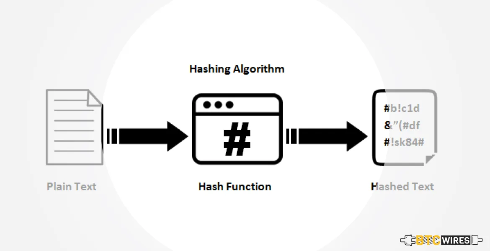
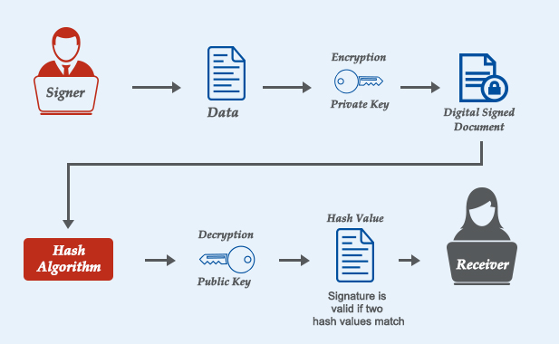
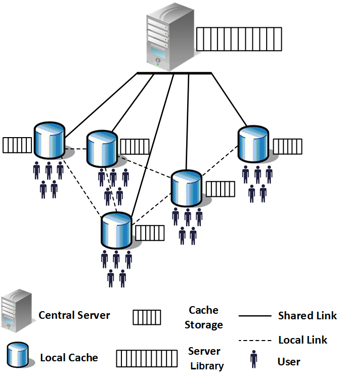

# 📌 Applications of Hashing

Hashing is a powerful technique used in many of the fastest known algorithms. It has numerous applications across different fields, including security, data structures, and file systems. One of the most recent and widely recognized applications of hashing is **Blockchain**.

With the rise of **Bitcoin** and other cryptocurrencies, hashing has gained immense attention. Even people with no background in **computer science** or **finance** have probably heard about Bitcoin recently.

> ❓ **DID YOU KNOW?**
> If you have used Python, you may be familiar with a built-in data structure called `dict` (dictionary).
> This data structure is actually based on **hashing**!

## 🔍 Applications of Hashing

### 🖥️ Programming Languages

Hashing plays a crucial role in programming language compilers and interpreters. Specifically, it helps:
- Quickly retrieve **keywords** (e.g., `for`, `if`, `while`, `in`).
- Distinguish between **keywords** and **user-defined identifiers** (e.g., variable names, function names).
- Optimize **symbol table lookups**, reducing lookup time from linear to nearly constant time.
- Improve **performance** in interpreters and compilers for real-time applications.

### 📂 File Systems

Hashing is used in file systems to efficiently map **human-readable file paths** to their actual **physical storage locations** on disk. This makes file retrieval fast and efficient. Some key applications include:
- **Indexing**: File systems use hash tables to keep track of file locations.
- **Deduplication**: Hashing helps identify duplicate files and remove redundant copies.
- **Security**: Hash-based checksums verify the integrity of stored files, ensuring they haven't been tampered with.

### 🔐 Cryptographic Hashing

Hashing plays a vital role in cryptography, ensuring data security, privacy, and authentication. Some important cryptographic uses include:
- **Password Storage**: Instead of storing actual passwords, systems store their hashes, making it harder for attackers to retrieve the original password.
- **Data Integrity**: Hash functions like SHA-256 and MD5 help verify that files or messages haven't been altered.
- **Digital Certificates**: Secure communication protocols (e.g., SSL/TLS) rely on hash functions to validate certificates and encrypt data.

### 🔏 Digital Signatures

Hashing is a fundamental component of **digital signatures**, which ensure:
1. **Authentication** – Prevents unauthorized users from signing documents on your behalf.
2. **Non-repudiation** – Ensures that the signer cannot deny signing a document later.
3. **Integrity** – Prevents tampering with the document contents (e.g., altering payment amounts in a digital check).

A real-world example of digital signatures is a physical check signed by **Donald Knuth**, a renowned computer scientist. As we move towards digital documents, hashing helps achieve the same level of security and authenticity.

### 🎮 Game Development
In video games, hashing is widely used for:
- **Asset Caching**: Quick retrieval of game assets (e.g., textures, models, and sounds).
- **Collision Detection**: Hashing helps optimize spatial partitioning and object interactions in 3D environments.
- **Cheat Prevention**: Games use hash-based integrity checks to detect unauthorized modifications.

### 🌐 Networking and Caching

Hashing is critical for optimizing network performance and caching strategies:
- **Load Balancing**: Hashing distributes network traffic efficiently across multiple servers.
- **DNS Resolution**: Domain Name System (DNS) uses hash tables to resolve domain names to IP addresses quickly.
- **Web Caching**: Content delivery networks (CDNs) use hashing to cache frequently accessed data, improving website performance.

---

Hashing is an essential tool in modern computing, with applications spanning programming, file systems, cryptography, game development, and beyond! 🚀
