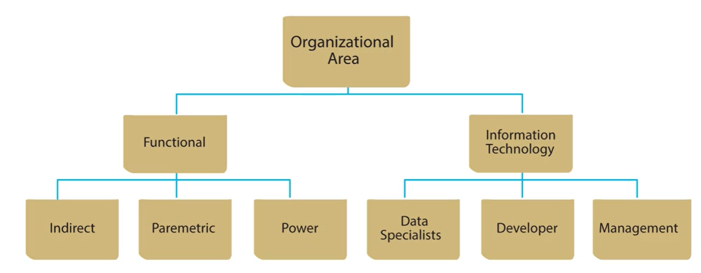

# Organizational Roles  

  

## Overview  
Databases are pervasive, and there are many ways to interact with them. This diagram distinguishes between:  
- **Functional users** – Those who interact with databases as part of their work.  
- **Information system professionals** – Those who design and implement databases.  

## Functional User Roles  
Functional users interact with databases at different levels based on their needs and expertise.  

### 1. Indirect User  
- Receives **reports or extracted data** from a database.  
- Does not interact directly with the database.  

### 2. Parametric User  
- An **active user** who interacts with predefined forms or reports.  
- Uses **parameters** (input values) to filter data dynamically.  
- Example:  
  - Selecting a **date range** for a sales report.  
  - Filtering records by **sales territory** or **department name**.  

### 3. Power User  
- The **most active** database user.  
- Works with **ad hoc (unplanned) database queries** for decision-making.  
- Skilled in **non-procedural access** (explored in the next lesson).  
- Can **build reports** independently as needed.  

## Information System Professionals  
These roles focus on the design, development, and management of databases.  

### 1. Developers  
- Responsible for:  
  - **Collecting requirements** for database systems.  
  - **Designing applications** that interact with databases.  
  - **Implementing information systems** by creating database views, forms, and reports.  

### 2. Management  
- **Oversight role** in database development and information systems.  
- Ensures developers and information system professionals follow best practices.  
- Must have a strong understanding of **database and application development**.  

## Data Administrator vs. Database Administrator  

### **Data Administrator (DA)**  
- **A managerial role** with planning and policy responsibilities.  
- Controls the **usage of data** across the organization.  
- Works with **both structured (business data) and unstructured data** (e.g., images, videos, social media).  

### **Database Administrator (DBA)**  
- **A technical role** focused on managing databases and DBMS.  
- Handles **database performance, security, and maintenance**.  
- Ensures **reliable access and storage** of data.  

### Key Differences:  
| Role | Responsibilities |
|------|----------------|
| **Data Administrator (DA)** | Plans and manages data policies, considers all data types (structured & unstructured). |
| **Database Administrator (DBA)** | Handles technical aspects of databases, focusing on individual DBMS systems. |
